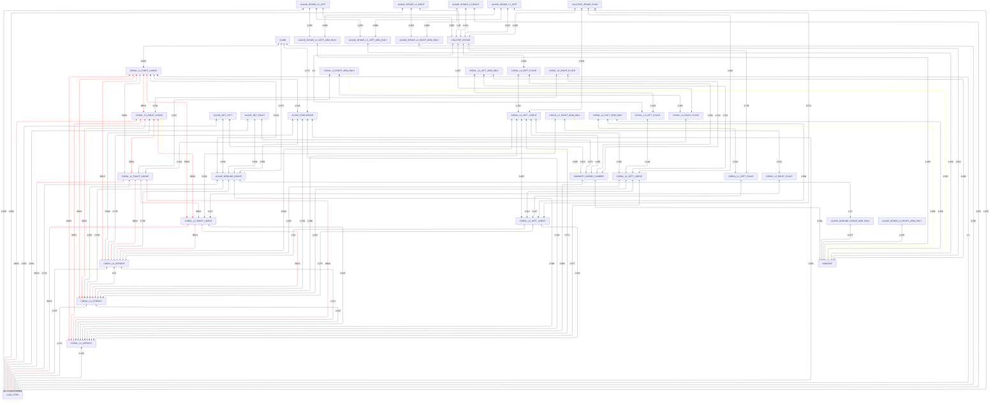

# Collision avoidance (right obstructed)

```mermaid
%%{ init: { "flowchart": { "defaultRenderer": "elk" } } }%%
graph TD

CORAL_L2_UPRIGHT <-- 1.126 --> LOW_STOW
CORAL_L3_UPRIGHT <-- 1.313 --> LOW_STOW
CORAL_L4_UPRIGHT <-- 1.435 --> LOW_STOW
CORAL_L2_RIGHT_LINEUP <-- 999.0 --> LOW_STOW
CORAL_L3_RIGHT_LINEUP <-- 999.0 --> LOW_STOW
CORAL_L4_RIGHT_LINEUP <-- 999.0 --> LOW_STOW
ALGAE_NET_LEFT <-- 1.854 --> LOW_STOW
ALGAE_NET_RIGHT <-- 1.854 --> LOW_STOW
CORAL_L1_RIGHT_LINEUP <-- 1.0 --> LOW_STOW
ALGAE_GROUND_INTAKE <-- 1.741 --> LOW_STOW
ALGAE_PROCESSOR <-- 1.661 --> LOW_STOW
CLIMB <-- 1.097 --> LOW_STOW
ALGAE_INTAKE_L2_LEFT <-- 1.686 --> LOW_STOW
ALGAE_INTAKE_L2_RIGHT <-- 1.686 --> LOW_STOW
ALGAE_INTAKE_L3_RIGHT <-- 1.837 --> LOW_STOW
ALGAE_INTAKE_L3_LEFT <-- 1.837 --> LOW_STOW
CORAL_L3_UPRIGHT <-- 1.112 --> CORAL_L2_UPRIGHT
CORAL_L4_UPRIGHT <-- 1.274 --> CORAL_L2_UPRIGHT
HANDOFF_CLEARS_CLIMBER <-- 1.896 --> CORAL_L2_UPRIGHT
CORAL_L2_LEFT_LINEUP <-- 1.015 --> CORAL_L2_UPRIGHT
CORAL_L2_RIGHT_LINEUP <-- 1.015 --> CORAL_L2_UPRIGHT
ALGAE_GROUND_INTAKE <-- 1.464 --> CORAL_L2_UPRIGHT
ALGAE_PROCESSOR <-- 1.344 --> CORAL_L2_UPRIGHT
CORAL_L3_LEFT_LINEUP <-- 1.477 --> CORAL_L2_UPRIGHT
CORAL_L4_LEFT_LINEUP <-- 1.573 --> CORAL_L2_UPRIGHT
CORAL_L1_RIGHT_LINEUP <-- 999.0 --> CORAL_L2_UPRIGHT
CORAL_L3_RIGHT_LINEUP <-- 999.0 --> CORAL_L2_UPRIGHT
CORAL_L4_RIGHT_LINEUP <-- 999.0 --> CORAL_L2_UPRIGHT
CORAL_L4_UPRIGHT <-- 1.07 --> CORAL_L3_UPRIGHT
CORAL_L3_LEFT_LINEUP <-- 1.015 --> CORAL_L3_UPRIGHT
CORAL_L3_RIGHT_LINEUP <-- 1.015 --> CORAL_L3_UPRIGHT
ALGAE_GROUND_INTAKE <-- 1.568 --> CORAL_L3_UPRIGHT
ALGAE_PROCESSOR <-- 1.561 --> CORAL_L3_UPRIGHT
CORAL_L2_LEFT_LINEUP <-- 1.477 --> CORAL_L3_UPRIGHT
CORAL_L4_LEFT_LINEUP <-- 1.368 --> CORAL_L3_UPRIGHT
CORAL_L1_RIGHT_LINEUP <-- 999.0 --> CORAL_L3_UPRIGHT
CORAL_L2_RIGHT_LINEUP <-- 999.0 --> CORAL_L3_UPRIGHT
CORAL_L4_RIGHT_LINEUP <-- 999.0 --> CORAL_L3_UPRIGHT
CORAL_L4_LEFT_LINEUP <-- 0.948 --> CORAL_L4_UPRIGHT
CORAL_L4_RIGHT_LINEUP <-- 0.948 --> CORAL_L4_UPRIGHT
ALGAE_GROUND_INTAKE <-- 1.756 --> CORAL_L4_UPRIGHT
ALGAE_PROCESSOR <-- 1.736 --> CORAL_L4_UPRIGHT
CORAL_L2_LEFT_LINEUP <-- 1.64 --> CORAL_L4_UPRIGHT
CORAL_L3_LEFT_LINEUP <-- 1.435 --> CORAL_L4_UPRIGHT
CORAL_L1_RIGHT_LINEUP <-- 999.0 --> CORAL_L4_UPRIGHT
CORAL_L2_RIGHT_LINEUP <-- 999.0 --> CORAL_L4_UPRIGHT
CORAL_L3_RIGHT_LINEUP <-- 999.0 --> CORAL_L4_UPRIGHT
HANDOFF_CLEARS_CLIMBER <-- 0.881 --> HANDOFF
ALGAE_GROUND_INTAKE_ARM_ONLY <-- 0.973 --> HANDOFF
CORAL_L2_RIGHT_ARM_ONLY <-- 1.581 --> HANDOFF
CORAL_L3_RIGHT_ARM_ONLY <-- 1.581 --> HANDOFF
CORAL_L2_LEFT_ARM_ONLY <-- 1.466 --> HANDOFF
CORAL_L3_LEFT_ARM_ONLY <-- 1.466 --> HANDOFF
ALGAE_INTAKE_L2_LEFT_ARM_ONLY <-- 1.466 --> HANDOFF
ALGAE_INTAKE_L2_RIGHT_ARM_ONLY <-- 1.015 --> HANDOFF
ALGAE_INTAKE_L3_LEFT_ARM_ONLY <-- 1.466 --> HANDOFF
ALGAE_INTAKE_L3_RIGHT_ARM_ONLY <-- 1.015 --> HANDOFF
CORAL_L4_LEFT_PLACE <-- 1.602 --> HANDOFF_CLEARS_CLIMBER
CORAL_L4_RIGHT_PLACE <-- 1.313 --> HANDOFF_CLEARS_CLIMBER
CORAL_L4_LEFT_LINEUP <-- 1.465 --> HANDOFF_CLEARS_CLIMBER
CORAL_L4_RIGHT_LINEUP <-- 1.595 --> HANDOFF_CLEARS_CLIMBER
ALGAE_NET_LEFT <-- 1.815 --> HANDOFF_CLEARS_CLIMBER
ALGAE_NET_RIGHT <-- 1.673 --> HANDOFF_CLEARS_CLIMBER
ALGAE_GROUND_INTAKE <-- 1.15 --> ALGAE_GROUND_INTAKE_ARM_ONLY
CORAL_L2_LEFT_PLACE <-- 1.117 --> CORAL_L2_LEFT_LINEUP
LOLLIPOP_INTAKE_PUSH <-- 1.574 --> CORAL_L2_LEFT_LINEUP
CORAL_L3_LEFT_LINEUP <-- 1.112 --> CORAL_L2_LEFT_LINEUP
CORAL_L4_LEFT_LINEUP <-- 1.485 --> CORAL_L2_LEFT_LINEUP
CORAL_L2_LEFT_ARM_ONLY <-- 1.584 --> CORAL_L2_LEFT_LINEUP
CORAL_L2_RIGHT_PLACE <-- 1.117 --> CORAL_L2_RIGHT_LINEUP
CORAL_L1_RIGHT_LINEUP <-- 999.0 --> CORAL_L2_RIGHT_LINEUP
CORAL_L3_RIGHT_LINEUP <-- 999.0 --> CORAL_L2_RIGHT_LINEUP
CORAL_L4_RIGHT_LINEUP <-- 999.0 --> CORAL_L2_RIGHT_LINEUP
CORAL_L2_RIGHT_ARM_ONLY <-- 1.584 --> CORAL_L2_RIGHT_LINEUP
ALGAE_NET_LEFT <-- 1.991 --> ALGAE_GROUND_INTAKE
ALGAE_NET_RIGHT <-- 1.826 --> ALGAE_GROUND_INTAKE
CORAL_L1_RIGHT_LINEUP <-- 1.614 --> ALGAE_GROUND_INTAKE
ALGAE_PROCESSOR <-- 1.059 --> ALGAE_GROUND_INTAKE
CLIMB <-- 1.507 --> ALGAE_GROUND_INTAKE
CORAL_L1_RIGHT_LINEUP <-- 1.516 --> ALGAE_PROCESSOR
CLIMB <-- 1.377 --> ALGAE_PROCESSOR
CORAL_L3_LEFT_PLACE <-- 1.144 --> CORAL_L3_LEFT_LINEUP
LOLLIPOP_INTAKE_PUSH <-- 1.822 --> CORAL_L3_LEFT_LINEUP
CORAL_L4_LEFT_LINEUP <-- 1.281 --> CORAL_L3_LEFT_LINEUP
CORAL_L3_LEFT_ARM_ONLY <-- 1.347 --> CORAL_L3_LEFT_LINEUP
CORAL_L3_RIGHT_PLACE <-- 1.144 --> CORAL_L3_RIGHT_LINEUP
CORAL_L1_RIGHT_LINEUP <-- 999.0 --> CORAL_L3_RIGHT_LINEUP
CORAL_L4_RIGHT_LINEUP <-- 999.0 --> CORAL_L3_RIGHT_LINEUP
CORAL_L3_RIGHT_ARM_ONLY <-- 1.347 --> CORAL_L3_RIGHT_LINEUP
CORAL_L4_LEFT_PLACE <-- 1.101 --> CORAL_L4_LEFT_LINEUP
LOLLIPOP_INTAKE_PUSH <-- 1.926 --> CORAL_L4_LEFT_LINEUP
CORAL_L4_RIGHT_PLACE <-- 1.101 --> CORAL_L4_RIGHT_LINEUP
CORAL_L1_RIGHT_LINEUP <-- 999.0 --> CORAL_L4_RIGHT_LINEUP
CLIMB <-- 0.929 --> CORAL_L1_RIGHT_LINEUP
CORAL_L2_LEFT_ARM_ONLY <-- 1.543 --> CORAL_L2_LEFT_PLACE
LOLLIPOP_INTAKE <-- 1.706 --> CORAL_L2_LEFT_PLACE
CORAL_L3_LEFT_ARM_ONLY <-- 1.349 --> CORAL_L3_LEFT_PLACE
LOLLIPOP_INTAKE <-- 1.9 --> CORAL_L3_LEFT_PLACE
LOLLIPOP_INTAKE <-- 2.081 --> CORAL_L4_LEFT_PLACE
CORAL_L2_RIGHT_ARM_ONLY <-- 1.543 --> CORAL_L2_RIGHT_PLACE
CORAL_L3_RIGHT_ARM_ONLY <-- 1.349 --> CORAL_L3_RIGHT_PLACE
LOLLIPOP_INTAKE <-- 1.437 --> CORAL_L3_RIGHT_PLACE
LOLLIPOP_INTAKE_PUSH <-- 1.185 --> LOLLIPOP_INTAKE
ALGAE_INTAKE_L2_LEFT <-- 1.887 --> LOLLIPOP_INTAKE
ALGAE_INTAKE_L2_RIGHT <-- 1.38 --> LOLLIPOP_INTAKE
ALGAE_INTAKE_L3_RIGHT <-- 1.531 --> LOLLIPOP_INTAKE
ALGAE_INTAKE_L3_LEFT <-- 2.037 --> LOLLIPOP_INTAKE
ALGAE_INTAKE_L2_LEFT <-- 1.359 --> ALGAE_INTAKE_L2_LEFT_ARM_ONLY
ALGAE_INTAKE_L3_LEFT <-- 0.966 --> ALGAE_INTAKE_L2_LEFT_ARM_ONLY
ALGAE_INTAKE_L2_LEFT <-- 1.359 --> ALGAE_INTAKE_L3_LEFT_ARM_ONLY
ALGAE_INTAKE_L3_LEFT <-- 0.966 --> ALGAE_INTAKE_L3_LEFT_ARM_ONLY
ALGAE_INTAKE_L2_RIGHT <-- 1.359 --> ALGAE_INTAKE_L3_RIGHT_ARM_ONLY
ALGAE_INTAKE_L3_RIGHT <-- 0.966 --> ALGAE_INTAKE_L3_RIGHT_ARM_ONLY

linkStyle 3,4,5,25,26,27,35,36,37,44,45,46,70,71,72,86,87,92 stroke:red;

linkStyle 49,50,60 stroke:yellow;
```
