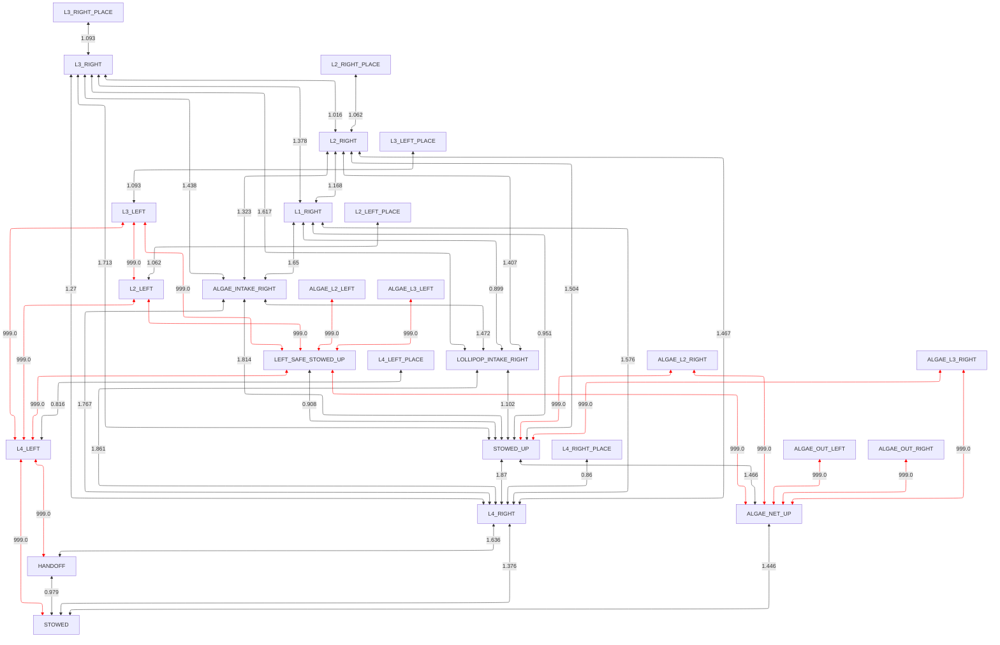

# Collision avoidance (left obstructed)

```mermaid
%%{ init: { "flowchart": { "defaultRenderer": "elk" } } }%%
graph TD

HANDOFF <-- 0.979 --> STOWED
L4_LEFT <-- 999.0 --> STOWED
L4_RIGHT <-- 1.376 --> STOWED
ALGAE_NET_UP <-- 1.446 --> STOWED
L4_LEFT <-- 999.0 --> HANDOFF
L4_RIGHT <-- 1.636 --> HANDOFF
LEFT_SAFE_STOWED_UP <-- 999.0 --> L4_LEFT
L2_LEFT <-- 999.0 --> L4_LEFT
L3_LEFT <-- 999.0 --> L4_LEFT
L4_LEFT_PLACE <-- 0.816 --> L4_LEFT
STOWED_UP <-- 1.87 --> L4_RIGHT
ALGAE_INTAKE_RIGHT <-- 1.767 --> L4_RIGHT
LOLLIPOP_INTAKE_RIGHT <-- 1.861 --> L4_RIGHT
L1_RIGHT <-- 1.576 --> L4_RIGHT
L2_RIGHT <-- 1.467 --> L4_RIGHT
L3_RIGHT <-- 1.27 --> L4_RIGHT
L4_RIGHT_PLACE <-- 0.86 --> L4_RIGHT
LEFT_SAFE_STOWED_UP <-- 999.0 --> ALGAE_NET_UP
STOWED_UP <-- 1.466 --> ALGAE_NET_UP
ALGAE_OUT_LEFT <-- 999.0 --> ALGAE_NET_UP
ALGAE_OUT_RIGHT <-- 999.0 --> ALGAE_NET_UP
ALGAE_L2_RIGHT <-- 999.0 --> ALGAE_NET_UP
ALGAE_L3_RIGHT <-- 999.0 --> ALGAE_NET_UP
LEFT_SAFE_STOWED_UP <-- 0.908 --> STOWED_UP
LOLLIPOP_INTAKE_RIGHT <-- 1.102 --> STOWED_UP
ALGAE_INTAKE_RIGHT <-- 1.814 --> STOWED_UP
L1_RIGHT <-- 0.951 --> STOWED_UP
L2_RIGHT <-- 1.504 --> STOWED_UP
L3_RIGHT <-- 1.713 --> STOWED_UP
ALGAE_L2_RIGHT <-- 999.0 --> STOWED_UP
ALGAE_L3_RIGHT <-- 999.0 --> STOWED_UP
L2_LEFT <-- 999.0 --> LEFT_SAFE_STOWED_UP
L3_LEFT <-- 999.0 --> LEFT_SAFE_STOWED_UP
ALGAE_L2_LEFT <-- 999.0 --> LEFT_SAFE_STOWED_UP
ALGAE_L3_LEFT <-- 999.0 --> LEFT_SAFE_STOWED_UP
ALGAE_INTAKE_RIGHT <-- 1.472 --> LOLLIPOP_INTAKE_RIGHT
L1_RIGHT <-- 0.899 --> LOLLIPOP_INTAKE_RIGHT
L2_RIGHT <-- 1.407 --> LOLLIPOP_INTAKE_RIGHT
L3_RIGHT <-- 1.617 --> LOLLIPOP_INTAKE_RIGHT
L1_RIGHT <-- 1.65 --> ALGAE_INTAKE_RIGHT
L2_RIGHT <-- 1.323 --> ALGAE_INTAKE_RIGHT
L3_RIGHT <-- 1.438 --> ALGAE_INTAKE_RIGHT
L3_LEFT <-- 999.0 --> L2_LEFT
L2_LEFT_PLACE <-- 1.062 --> L2_LEFT
L3_LEFT_PLACE <-- 1.093 --> L3_LEFT
L2_RIGHT <-- 1.168 --> L1_RIGHT
L3_RIGHT <-- 1.378 --> L1_RIGHT
L3_RIGHT <-- 1.016 --> L2_RIGHT
L2_RIGHT_PLACE <-- 1.062 --> L2_RIGHT
L3_RIGHT_PLACE <-- 1.093 --> L3_RIGHT

linkStyle 1,4,6,7,8,17,19,20,21,22,29,30,31,32,33,34,42 stroke:red;
```
