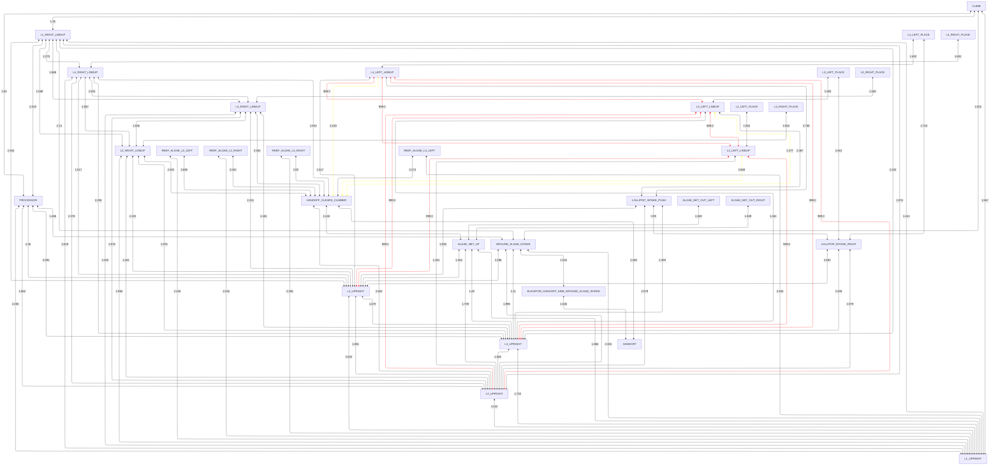

# Collision avoidance (left obstructed)

```mermaid
%%{ init: { "flowchart": { "defaultRenderer": "elk" } } }%%
graph TD

L2_UPRIGHT <-- 1.522 --> L1_UPRIGHT
L3_UPRIGHT <-- 1.732 --> L1_UPRIGHT
L4_UPRIGHT <-- 2.002 --> L1_UPRIGHT
ALGAE_NET_UP <-- 1.884 --> L1_UPRIGHT
L2_RIGHT_LINEUP <-- 1.994 --> L1_UPRIGHT
L3_RIGHT_LINEUP <-- 2.203 --> L1_UPRIGHT
L4_RIGHT_LINEUP <-- 2.529 --> L1_UPRIGHT
L1_RIGHT_LINEUP <-- 1.441 --> L1_UPRIGHT
GROUND_ALGAE_INTAKE <-- 2.304 --> L1_UPRIGHT
PROCESSOR <-- 2.206 --> L1_UPRIGHT
CLIMB <-- 1.567 --> L1_UPRIGHT
REEF_ALGAE_L2_LEFT <-- 2.226 --> L1_UPRIGHT
REEF_ALGAE_L2_RIGHT <-- 2.226 --> L1_UPRIGHT
REEF_ALGAE_L3_RIGHT <-- 2.394 --> L1_UPRIGHT
REEF_ALGAE_L3_LEFT <-- 2.394 --> L1_UPRIGHT
L3_UPRIGHT <-- 1.506 --> L2_UPRIGHT
L4_UPRIGHT <-- 1.851 --> L2_UPRIGHT
ALGAE_NET_UP <-- 1.709 --> L2_UPRIGHT
HANDOFF_CLEARS_CLIMBER <-- 2.602 --> L2_UPRIGHT
L2_LEFT_LINEUP <-- 1.461 --> L2_UPRIGHT
L2_RIGHT_LINEUP <-- 1.461 --> L2_UPRIGHT
GROUND_ALGAE_INTAKE <-- 1.995 --> L2_UPRIGHT
PROCESSOR <-- 1.852 --> L2_UPRIGHT
LOLLIPOP_INTAKE_RIGHT <-- 2.079 --> L2_UPRIGHT
LOLLIPOP_INTAKE_PUSH <-- 2.079 --> L2_UPRIGHT
L3_LEFT_LINEUP <-- 999.0 --> L2_UPRIGHT
L4_LEFT_LINEUP <-- 999.0 --> L2_UPRIGHT
L1_RIGHT_LINEUP <-- 1.974 --> L2_UPRIGHT
L3_RIGHT_LINEUP <-- 1.978 --> L2_UPRIGHT
L4_RIGHT_LINEUP <-- 2.378 --> L2_UPRIGHT
L4_UPRIGHT <-- 1.679 --> L3_UPRIGHT
ALGAE_NET_UP <-- 1.49 --> L3_UPRIGHT
L3_LEFT_LINEUP <-- 1.461 --> L3_UPRIGHT
L3_RIGHT_LINEUP <-- 1.461 --> L3_UPRIGHT
GROUND_ALGAE_INTAKE <-- 2.11 --> L3_UPRIGHT
PROCESSOR <-- 2.094 --> L3_UPRIGHT
LOLLIPOP_INTAKE_RIGHT <-- 2.309 --> L3_UPRIGHT
LOLLIPOP_INTAKE_PUSH <-- 2.309 --> L3_UPRIGHT
L2_LEFT_LINEUP <-- 999.0 --> L3_UPRIGHT
L4_LEFT_LINEUP <-- 999.0 --> L3_UPRIGHT
L1_RIGHT_LINEUP <-- 2.183 --> L3_UPRIGHT
L2_RIGHT_LINEUP <-- 1.978 --> L3_UPRIGHT
L4_RIGHT_LINEUP <-- 2.206 --> L3_UPRIGHT
ALGAE_NET_UP <-- 1.464 --> L4_UPRIGHT
L4_LEFT_LINEUP <-- 1.517 --> L4_UPRIGHT
L4_RIGHT_LINEUP <-- 1.517 --> L4_UPRIGHT
GROUND_ALGAE_INTAKE <-- 2.498 --> L4_UPRIGHT
PROCESSOR <-- 2.46 --> L4_UPRIGHT
LOLLIPOP_INTAKE_RIGHT <-- 2.593 --> L4_UPRIGHT
LOLLIPOP_INTAKE_PUSH <-- 2.593 --> L4_UPRIGHT
L2_LEFT_LINEUP <-- 999.0 --> L4_UPRIGHT
L3_LEFT_LINEUP <-- 999.0 --> L4_UPRIGHT
L1_RIGHT_LINEUP <-- 2.454 --> L4_UPRIGHT
L2_RIGHT_LINEUP <-- 2.323 --> L4_UPRIGHT
L3_RIGHT_LINEUP <-- 2.151 --> L4_UPRIGHT
ALGAE_NET_OUT_LEFT <-- 1.849 --> ALGAE_NET_UP
ALGAE_NET_OUT_RIGHT <-- 1.849 --> ALGAE_NET_UP
HANDOFF_CLEARS_CLIMBER <-- 2.148 --> ALGAE_NET_UP
HANDOFF_CLEARS_CLIMBER <-- 1.469 --> HANDOFF
ELEVATOR_HANDOFF_ARM_GROUND_ALGAE_INTAKE <-- 1.536 --> HANDOFF
L2_LEFT_LINEUP <-- 2.668 --> HANDOFF_CLEARS_CLIMBER
L3_LEFT_LINEUP <-- 2.477 --> HANDOFF_CLEARS_CLIMBER
L4_LEFT_LINEUP <-- 2.169 --> HANDOFF_CLEARS_CLIMBER
L2_RIGHT_LINEUP <-- 2.452 --> HANDOFF_CLEARS_CLIMBER
L3_RIGHT_LINEUP <-- 2.262 --> HANDOFF_CLEARS_CLIMBER
L4_RIGHT_LINEUP <-- 1.943 --> HANDOFF_CLEARS_CLIMBER
REEF_ALGAE_L2_LEFT <-- 2.685 --> HANDOFF_CLEARS_CLIMBER
REEF_ALGAE_L2_RIGHT <-- 2.263 --> HANDOFF_CLEARS_CLIMBER
REEF_ALGAE_L3_RIGHT <-- 2.05 --> HANDOFF_CLEARS_CLIMBER
REEF_ALGAE_L3_LEFT <-- 2.473 --> HANDOFF_CLEARS_CLIMBER
GROUND_ALGAE_INTAKE <-- 1.534 --> ELEVATOR_HANDOFF_ARM_GROUND_ALGAE_INTAKE
L2_LEFT_PLACE <-- 1.552 --> L2_LEFT_LINEUP
L3_LEFT_LINEUP <-- 999.0 --> L2_LEFT_LINEUP
L4_LEFT_LINEUP <-- 999.0 --> L2_LEFT_LINEUP
L2_RIGHT_PLACE <-- 1.552 --> L2_RIGHT_LINEUP
L1_RIGHT_LINEUP <-- 1.658 --> L2_RIGHT_LINEUP
L3_RIGHT_LINEUP <-- 1.506 --> L2_RIGHT_LINEUP
L4_RIGHT_LINEUP <-- 2.087 --> L2_RIGHT_LINEUP
L1_RIGHT_LINEUP <-- 2.14 --> GROUND_ALGAE_INTAKE
PROCESSOR <-- 1.486 --> GROUND_ALGAE_INTAKE
CLIMB <-- 2.001 --> GROUND_ALGAE_INTAKE
L1_RIGHT_LINEUP <-- 2.019 --> PROCESSOR
CLIMB <-- 1.84 --> PROCESSOR
LOLLIPOP_INTAKE_PUSH <-- 0.99 --> LOLLIPOP_INTAKE_RIGHT
L3_LEFT_PLACE <-- 2.461 --> LOLLIPOP_INTAKE_RIGHT
L4_LEFT_PLACE <-- 2.744 --> LOLLIPOP_INTAKE_RIGHT
L3_LEFT_LINEUP <-- 2.467 --> LOLLIPOP_INTAKE_PUSH
L4_LEFT_LINEUP <-- 2.785 --> LOLLIPOP_INTAKE_PUSH
L3_LEFT_PLACE <-- 1.583 --> L3_LEFT_LINEUP
L4_LEFT_LINEUP <-- 999.0 --> L3_LEFT_LINEUP
L3_RIGHT_PLACE <-- 1.583 --> L3_RIGHT_LINEUP
L1_RIGHT_LINEUP <-- 1.868 --> L3_RIGHT_LINEUP
L4_RIGHT_LINEUP <-- 1.915 --> L3_RIGHT_LINEUP
L4_LEFT_PLACE <-- 1.602 --> L4_LEFT_LINEUP
L4_RIGHT_PLACE <-- 1.602 --> L4_RIGHT_LINEUP
L1_RIGHT_LINEUP <-- 2.275 --> L4_RIGHT_LINEUP
CLIMB <-- 1.35 --> L1_RIGHT_LINEUP

linkStyle 25,26,38,39,50,51,72,73,89 stroke:red;

linkStyle 60,61,62 stroke:yellow;
```
