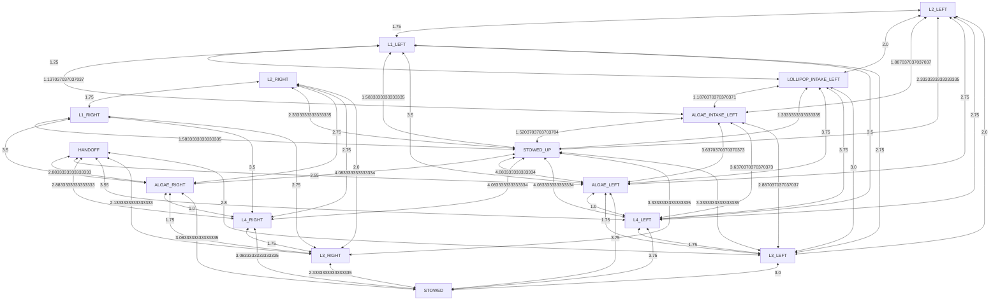

# Collision avoidance (left obstructed)

```mermaid
graph TD

L4_RIGHT <-- 3.0833333333333335 --> STOWED
L4_LEFT <-- 3.75 --> STOWED
ALGAE_LEFT <-- 3.75 --> STOWED
ALGAE_RIGHT <-- 3.0833333333333335 --> STOWED
L3_RIGHT <-- 2.3333333333333335 --> STOWED
L3_LEFT <-- 3.0 --> STOWED
L1_LEFT <-- 2.75 --> L3_LEFT
STOWED_UP <-- 3.3333333333333335 --> L3_LEFT
L2_LEFT <-- 2.0 --> L3_LEFT
L4_LEFT <-- 1.75 --> L3_LEFT
ALGAE_LEFT <-- 1.75 --> L3_LEFT
ALGAE_INTAKE_LEFT <-- 2.887037037037037 --> L3_LEFT
LOLLIPOP_INTAKE_LEFT <-- 3.0 --> L3_LEFT
HANDOFF <-- 2.8 --> L3_LEFT
L2_RIGHT <-- 2.0 --> L3_RIGHT
L4_RIGHT <-- 1.75 --> L3_RIGHT
ALGAE_RIGHT <-- 1.75 --> L3_RIGHT
STOWED_UP <-- 3.3333333333333335 --> L3_RIGHT
L1_RIGHT <-- 2.75 --> L3_RIGHT
HANDOFF <-- 2.1333333333333333 --> L3_RIGHT
L1_LEFT <-- 3.5 --> L4_LEFT
STOWED_UP <-- 4.083333333333334 --> L4_LEFT
L2_LEFT <-- 2.75 --> L4_LEFT
ALGAE_LEFT <-- 1.0 --> L4_LEFT
ALGAE_INTAKE_LEFT <-- 3.6370370370370373 --> L4_LEFT
LOLLIPOP_INTAKE_LEFT <-- 3.75 --> L4_LEFT
HANDOFF <-- 3.55 --> L4_LEFT
L2_RIGHT <-- 2.75 --> L4_RIGHT
ALGAE_RIGHT <-- 1.0 --> L4_RIGHT
STOWED_UP <-- 4.083333333333334 --> L4_RIGHT
L1_RIGHT <-- 3.5 --> L4_RIGHT
HANDOFF <-- 2.8833333333333333 --> L4_RIGHT
L1_LEFT <-- 3.5 --> ALGAE_LEFT
STOWED_UP <-- 4.083333333333334 --> ALGAE_LEFT
L2_LEFT <-- 2.75 --> ALGAE_LEFT
ALGAE_INTAKE_LEFT <-- 3.6370370370370373 --> ALGAE_LEFT
LOLLIPOP_INTAKE_LEFT <-- 3.75 --> ALGAE_LEFT
HANDOFF <-- 3.55 --> ALGAE_LEFT
L2_RIGHT <-- 2.75 --> ALGAE_RIGHT
STOWED_UP <-- 4.083333333333334 --> ALGAE_RIGHT
L1_RIGHT <-- 3.5 --> ALGAE_RIGHT
HANDOFF <-- 2.8833333333333333 --> ALGAE_RIGHT
L1_LEFT <-- 1.5833333333333335 --> STOWED_UP
L2_LEFT <-- 2.3333333333333335 --> STOWED_UP
L2_RIGHT <-- 2.3333333333333335 --> STOWED_UP
ALGAE_INTAKE_LEFT <-- 1.5203703703703704 --> STOWED_UP
LOLLIPOP_INTAKE_LEFT <-- 1.3333333333333335 --> STOWED_UP
L1_RIGHT <-- 1.5833333333333335 --> STOWED_UP
L1_LEFT <-- 1.137037037037037 --> ALGAE_INTAKE_LEFT
L2_LEFT <-- 1.887037037037037 --> ALGAE_INTAKE_LEFT
LOLLIPOP_INTAKE_LEFT <-- 1.1870370370370371 --> ALGAE_INTAKE_LEFT
L1_LEFT <-- 1.25 --> LOLLIPOP_INTAKE_LEFT
L2_LEFT <-- 2.0 --> LOLLIPOP_INTAKE_LEFT
L2_LEFT <-- 1.75 --> L1_LEFT
L2_RIGHT <-- 1.75 --> L1_RIGHT
```
