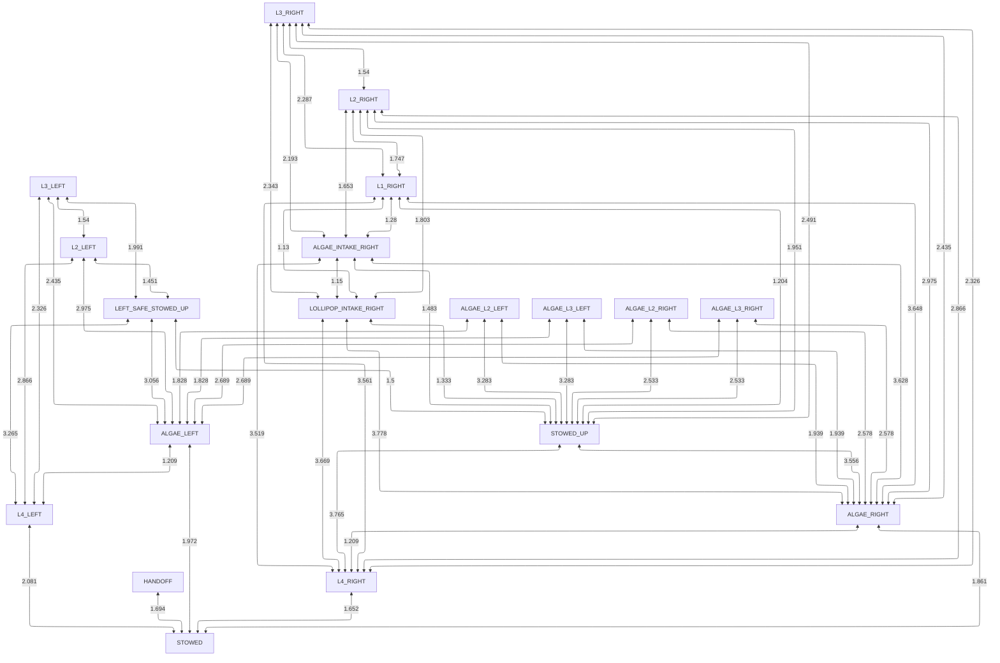

# Collision avoidance (unobstructed)

```mermaid
%%{ init: { "flowchart": { "defaultRenderer": "elk" } } }%%
graph TD

HANDOFF <-- 1.694 --> STOWED
L4_LEFT <-- 2.081 --> STOWED
L4_RIGHT <-- 1.652 --> STOWED
ALGAE_RIGHT <-- 1.861 --> STOWED
ALGAE_LEFT <-- 1.972 --> STOWED
LEFT_SAFE_STOWED_UP <-- 3.265 --> L4_LEFT
L2_LEFT <-- 2.866 --> L4_LEFT
L3_LEFT <-- 2.326 --> L4_LEFT
ALGAE_LEFT <-- 1.209 --> L4_LEFT
STOWED_UP <-- 3.765 --> L4_RIGHT
ALGAE_INTAKE_RIGHT <-- 3.519 --> L4_RIGHT
LOLLIPOP_INTAKE_RIGHT <-- 3.669 --> L4_RIGHT
L1_RIGHT <-- 3.561 --> L4_RIGHT
L2_RIGHT <-- 2.866 --> L4_RIGHT
L3_RIGHT <-- 2.326 --> L4_RIGHT
ALGAE_RIGHT <-- 1.209 --> L4_RIGHT
STOWED_UP <-- 3.556 --> ALGAE_RIGHT
ALGAE_L2_LEFT <-- 1.939 --> ALGAE_RIGHT
ALGAE_L3_LEFT <-- 1.939 --> ALGAE_RIGHT
ALGAE_INTAKE_RIGHT <-- 3.628 --> ALGAE_RIGHT
LOLLIPOP_INTAKE_RIGHT <-- 3.778 --> ALGAE_RIGHT
L1_RIGHT <-- 3.648 --> ALGAE_RIGHT
L2_RIGHT <-- 2.975 --> ALGAE_RIGHT
L3_RIGHT <-- 2.435 --> ALGAE_RIGHT
ALGAE_L2_RIGHT <-- 2.578 --> ALGAE_RIGHT
ALGAE_L3_RIGHT <-- 2.578 --> ALGAE_RIGHT
LEFT_SAFE_STOWED_UP <-- 3.056 --> ALGAE_LEFT
L2_LEFT <-- 2.975 --> ALGAE_LEFT
L3_LEFT <-- 2.435 --> ALGAE_LEFT
ALGAE_L2_LEFT <-- 1.828 --> ALGAE_LEFT
ALGAE_L3_LEFT <-- 1.828 --> ALGAE_LEFT
ALGAE_L2_RIGHT <-- 2.689 --> ALGAE_LEFT
ALGAE_L3_RIGHT <-- 2.689 --> ALGAE_LEFT
LEFT_SAFE_STOWED_UP <-- 1.5 --> STOWED_UP
LOLLIPOP_INTAKE_RIGHT <-- 1.333 --> STOWED_UP
ALGAE_INTAKE_RIGHT <-- 1.483 --> STOWED_UP
L1_RIGHT <-- 1.204 --> STOWED_UP
L2_RIGHT <-- 1.951 --> STOWED_UP
L3_RIGHT <-- 2.491 --> STOWED_UP
ALGAE_L2_LEFT <-- 3.283 --> STOWED_UP
ALGAE_L2_RIGHT <-- 2.533 --> STOWED_UP
ALGAE_L3_LEFT <-- 3.283 --> STOWED_UP
ALGAE_L3_RIGHT <-- 2.533 --> STOWED_UP
L2_LEFT <-- 1.451 --> LEFT_SAFE_STOWED_UP
L3_LEFT <-- 1.991 --> LEFT_SAFE_STOWED_UP
ALGAE_INTAKE_RIGHT <-- 1.15 --> LOLLIPOP_INTAKE_RIGHT
L1_RIGHT <-- 1.13 --> LOLLIPOP_INTAKE_RIGHT
L2_RIGHT <-- 1.803 --> LOLLIPOP_INTAKE_RIGHT
L3_RIGHT <-- 2.343 --> LOLLIPOP_INTAKE_RIGHT
L1_RIGHT <-- 1.28 --> ALGAE_INTAKE_RIGHT
L2_RIGHT <-- 1.653 --> ALGAE_INTAKE_RIGHT
L3_RIGHT <-- 2.193 --> ALGAE_INTAKE_RIGHT
L3_LEFT <-- 1.54 --> L2_LEFT
L2_RIGHT <-- 1.747 --> L1_RIGHT
L3_RIGHT <-- 2.287 --> L1_RIGHT
L3_RIGHT <-- 1.54 --> L2_RIGHT
```
