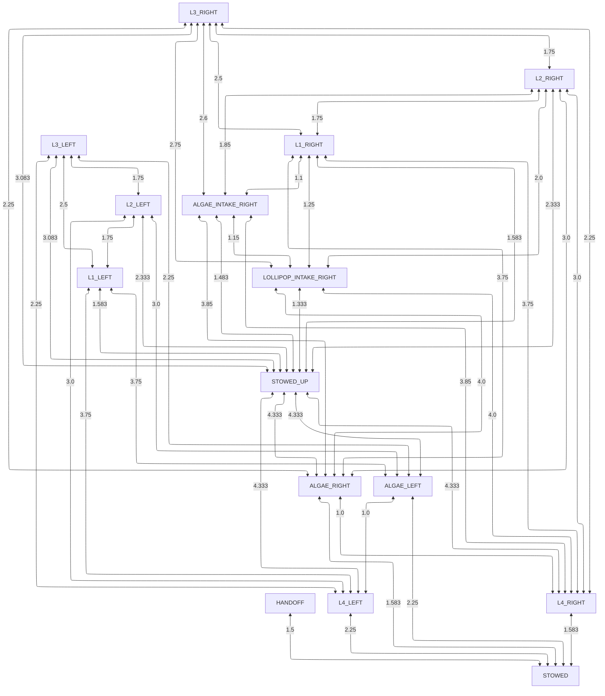

# Collision avoidance (unobstructed)

```mermaid
%%{ init: { "flowchart": { "defaultRenderer": "elk" } } }%%
graph TD

HANDOFF <-- 1.5 --> STOWED
L4_LEFT <-- 2.25 --> STOWED
L4_RIGHT <-- 1.583 --> STOWED
ALGAE_RIGHT <-- 1.583 --> STOWED
ALGAE_LEFT <-- 2.25 --> STOWED
STOWED_UP <-- 4.333 --> L4_LEFT
L1_LEFT <-- 3.75 --> L4_LEFT
L2_LEFT <-- 3.0 --> L4_LEFT
L3_LEFT <-- 2.25 --> L4_LEFT
ALGAE_LEFT <-- 1.0 --> L4_LEFT
STOWED_UP <-- 4.333 --> L4_RIGHT
ALGAE_INTAKE_RIGHT <-- 3.85 --> L4_RIGHT
LOLLIPOP_INTAKE_RIGHT <-- 4.0 --> L4_RIGHT
L1_RIGHT <-- 3.75 --> L4_RIGHT
L2_RIGHT <-- 3.0 --> L4_RIGHT
L3_RIGHT <-- 2.25 --> L4_RIGHT
ALGAE_RIGHT <-- 1.0 --> L4_RIGHT
STOWED_UP <-- 4.333 --> ALGAE_RIGHT
ALGAE_INTAKE_RIGHT <-- 3.85 --> ALGAE_RIGHT
LOLLIPOP_INTAKE_RIGHT <-- 4.0 --> ALGAE_RIGHT
L1_RIGHT <-- 3.75 --> ALGAE_RIGHT
L2_RIGHT <-- 3.0 --> ALGAE_RIGHT
L3_RIGHT <-- 2.25 --> ALGAE_RIGHT
STOWED_UP <-- 4.333 --> ALGAE_LEFT
L1_LEFT <-- 3.75 --> ALGAE_LEFT
L2_LEFT <-- 3.0 --> ALGAE_LEFT
L3_LEFT <-- 2.25 --> ALGAE_LEFT
LOLLIPOP_INTAKE_RIGHT <-- 1.333 --> STOWED_UP
ALGAE_INTAKE_RIGHT <-- 1.483 --> STOWED_UP
L1_LEFT <-- 1.583 --> STOWED_UP
L2_LEFT <-- 2.333 --> STOWED_UP
L3_LEFT <-- 3.083 --> STOWED_UP
L1_RIGHT <-- 1.583 --> STOWED_UP
L2_RIGHT <-- 2.333 --> STOWED_UP
L3_RIGHT <-- 3.083 --> STOWED_UP
ALGAE_INTAKE_RIGHT <-- 1.15 --> LOLLIPOP_INTAKE_RIGHT
L1_RIGHT <-- 1.25 --> LOLLIPOP_INTAKE_RIGHT
L2_RIGHT <-- 2.0 --> LOLLIPOP_INTAKE_RIGHT
L3_RIGHT <-- 2.75 --> LOLLIPOP_INTAKE_RIGHT
L1_RIGHT <-- 1.1 --> ALGAE_INTAKE_RIGHT
L2_RIGHT <-- 1.85 --> ALGAE_INTAKE_RIGHT
L3_RIGHT <-- 2.6 --> ALGAE_INTAKE_RIGHT
L2_LEFT <-- 1.75 --> L1_LEFT
L3_LEFT <-- 2.5 --> L1_LEFT
L3_LEFT <-- 1.75 --> L2_LEFT
L2_RIGHT <-- 1.75 --> L1_RIGHT
L3_RIGHT <-- 2.5 --> L1_RIGHT
L3_RIGHT <-- 1.75 --> L2_RIGHT
```
