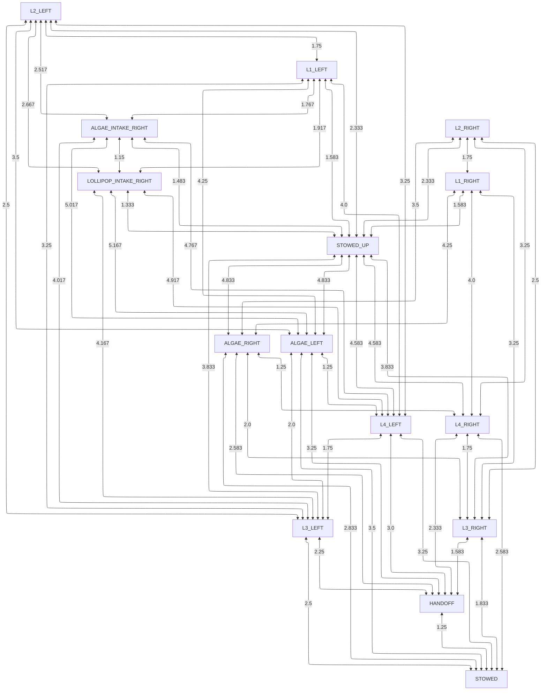

# Collision avoidance (unobstructed)

```mermaid
%%{ init: { "flowchart": { "defaultRenderer": "elk" } } }%%
graph TD

HANDOFF <-- 1.25 --> STOWED
L3_LEFT <-- 2.5 --> STOWED
L3_RIGHT <-- 1.833 --> STOWED
L4_LEFT <-- 3.25 --> STOWED
L4_RIGHT <-- 2.583 --> STOWED
ALGAE_RIGHT <-- 2.833 --> STOWED
ALGAE_LEFT <-- 3.5 --> STOWED
L3_LEFT <-- 2.25 --> HANDOFF
L3_RIGHT <-- 1.583 --> HANDOFF
L4_LEFT <-- 3.0 --> HANDOFF
L4_RIGHT <-- 2.333 --> HANDOFF
ALGAE_LEFT <-- 3.25 --> HANDOFF
ALGAE_RIGHT <-- 2.583 --> HANDOFF
STOWED_UP <-- 3.833 --> L3_LEFT
ALGAE_INTAKE_RIGHT <-- 4.017 --> L3_LEFT
LOLLIPOP_INTAKE_RIGHT <-- 4.167 --> L3_LEFT
L1_LEFT <-- 3.25 --> L3_LEFT
L2_LEFT <-- 2.5 --> L3_LEFT
L4_LEFT <-- 1.75 --> L3_LEFT
ALGAE_LEFT <-- 2.0 --> L3_LEFT
STOWED_UP <-- 3.833 --> L3_RIGHT
L1_RIGHT <-- 3.25 --> L3_RIGHT
L2_RIGHT <-- 2.5 --> L3_RIGHT
L4_RIGHT <-- 1.75 --> L3_RIGHT
ALGAE_RIGHT <-- 2.0 --> L3_RIGHT
STOWED_UP <-- 4.583 --> L4_LEFT
ALGAE_INTAKE_RIGHT <-- 4.767 --> L4_LEFT
LOLLIPOP_INTAKE_RIGHT <-- 4.917 --> L4_LEFT
L1_LEFT <-- 4.0 --> L4_LEFT
L2_LEFT <-- 3.25 --> L4_LEFT
ALGAE_LEFT <-- 1.25 --> L4_LEFT
STOWED_UP <-- 4.583 --> L4_RIGHT
L1_RIGHT <-- 4.0 --> L4_RIGHT
L2_RIGHT <-- 3.25 --> L4_RIGHT
ALGAE_RIGHT <-- 1.25 --> L4_RIGHT
STOWED_UP <-- 4.833 --> ALGAE_RIGHT
L1_RIGHT <-- 4.25 --> ALGAE_RIGHT
L2_RIGHT <-- 3.5 --> ALGAE_RIGHT
STOWED_UP <-- 4.833 --> ALGAE_LEFT
ALGAE_INTAKE_RIGHT <-- 5.017 --> ALGAE_LEFT
LOLLIPOP_INTAKE_RIGHT <-- 5.167 --> ALGAE_LEFT
L1_LEFT <-- 4.25 --> ALGAE_LEFT
L2_LEFT <-- 3.5 --> ALGAE_LEFT
LOLLIPOP_INTAKE_RIGHT <-- 1.333 --> STOWED_UP
ALGAE_INTAKE_RIGHT <-- 1.483 --> STOWED_UP
L1_LEFT <-- 1.583 --> STOWED_UP
L2_LEFT <-- 2.333 --> STOWED_UP
L1_RIGHT <-- 1.583 --> STOWED_UP
L2_RIGHT <-- 2.333 --> STOWED_UP
ALGAE_INTAKE_RIGHT <-- 1.15 --> LOLLIPOP_INTAKE_RIGHT
L1_LEFT <-- 1.917 --> LOLLIPOP_INTAKE_RIGHT
L2_LEFT <-- 2.667 --> LOLLIPOP_INTAKE_RIGHT
L1_LEFT <-- 1.767 --> ALGAE_INTAKE_RIGHT
L2_LEFT <-- 2.517 --> ALGAE_INTAKE_RIGHT
L2_LEFT <-- 1.75 --> L1_LEFT
L2_RIGHT <-- 1.75 --> L1_RIGHT
```
