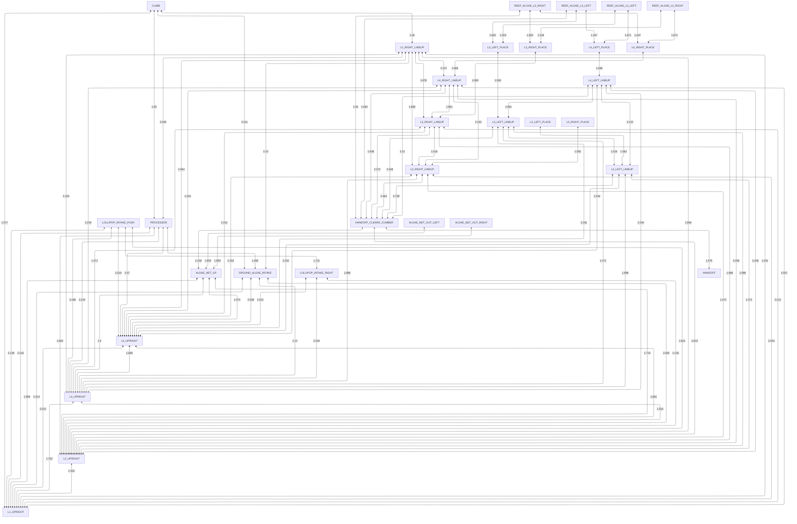

# Collision avoidance (unobstructed)

```mermaid
%%{ init: { "flowchart": { "defaultRenderer": "elk" } } }%%
graph TD

L2_UPRIGHT <-- 1.532 --> L1_UPRIGHT
L3_UPRIGHT <-- 1.742 --> L1_UPRIGHT
L4_UPRIGHT <-- 2.012 --> L1_UPRIGHT
ALGAE_NET_UP <-- 1.894 --> L1_UPRIGHT
L2_RIGHT_LINEUP <-- 2.004 --> L1_UPRIGHT
L3_RIGHT_LINEUP <-- 2.213 --> L1_UPRIGHT
L4_RIGHT_LINEUP <-- 2.557 --> L1_UPRIGHT
LOLLIPOP_INTAKE_PUSH <-- 2.138 --> L1_UPRIGHT
L1_RIGHT_LINEUP <-- 1.451 --> L1_UPRIGHT
GROUND_ALGAE_INTAKE <-- 2.314 --> L1_UPRIGHT
PROCESSOR <-- 2.216 --> L1_UPRIGHT
CLIMB <-- 1.577 --> L1_UPRIGHT
L3_UPRIGHT <-- 1.516 --> L2_UPRIGHT
L4_UPRIGHT <-- 1.861 --> L2_UPRIGHT
ALGAE_NET_UP <-- 1.719 --> L2_UPRIGHT
HANDOFF_CLEARS_CLIMBER <-- 2.612 --> L2_UPRIGHT
L2_LEFT_LINEUP <-- 1.471 --> L2_UPRIGHT
L2_RIGHT_LINEUP <-- 1.471 --> L2_UPRIGHT
GROUND_ALGAE_INTAKE <-- 2.005 --> L2_UPRIGHT
PROCESSOR <-- 1.862 --> L2_UPRIGHT
LOLLIPOP_INTAKE_RIGHT <-- 2.135 --> L2_UPRIGHT
LOLLIPOP_INTAKE_PUSH <-- 1.821 --> L2_UPRIGHT
L3_LEFT_LINEUP <-- 1.988 --> L2_UPRIGHT
L4_LEFT_LINEUP <-- 2.406 --> L2_UPRIGHT
L1_RIGHT_LINEUP <-- 1.984 --> L2_UPRIGHT
L3_RIGHT_LINEUP <-- 1.988 --> L2_UPRIGHT
L4_RIGHT_LINEUP <-- 2.406 --> L2_UPRIGHT
L4_UPRIGHT <-- 1.689 --> L3_UPRIGHT
ALGAE_NET_UP <-- 1.5 --> L3_UPRIGHT
L3_LEFT_LINEUP <-- 1.471 --> L3_UPRIGHT
L3_RIGHT_LINEUP <-- 1.471 --> L3_UPRIGHT
GROUND_ALGAE_INTAKE <-- 2.12 --> L3_UPRIGHT
PROCESSOR <-- 2.104 --> L3_UPRIGHT
LOLLIPOP_INTAKE_RIGHT <-- 2.344 --> L3_UPRIGHT
LOLLIPOP_INTAKE_PUSH <-- 2.186 --> L3_UPRIGHT
L2_LEFT_LINEUP <-- 1.988 --> L3_UPRIGHT
L4_LEFT_LINEUP <-- 2.234 --> L3_UPRIGHT
L1_RIGHT_LINEUP <-- 2.193 --> L3_UPRIGHT
L2_RIGHT_LINEUP <-- 1.988 --> L3_UPRIGHT
L4_RIGHT_LINEUP <-- 2.234 --> L3_UPRIGHT
ALGAE_NET_UP <-- 1.474 --> L4_UPRIGHT
L4_LEFT_LINEUP <-- 1.544 --> L4_UPRIGHT
L4_RIGHT_LINEUP <-- 1.544 --> L4_UPRIGHT
GROUND_ALGAE_INTAKE <-- 2.508 --> L4_UPRIGHT
PROCESSOR <-- 2.47 --> L4_UPRIGHT
LOLLIPOP_INTAKE_RIGHT <-- 2.615 --> L4_UPRIGHT
LOLLIPOP_INTAKE_PUSH <-- 2.519 --> L4_UPRIGHT
L2_LEFT_LINEUP <-- 2.333 --> L4_UPRIGHT
L3_LEFT_LINEUP <-- 2.161 --> L4_UPRIGHT
L1_RIGHT_LINEUP <-- 2.464 --> L4_UPRIGHT
L2_RIGHT_LINEUP <-- 2.333 --> L4_UPRIGHT
L3_RIGHT_LINEUP <-- 2.161 --> L4_UPRIGHT
ALGAE_NET_OUT_LEFT <-- 1.859 --> ALGAE_NET_UP
ALGAE_NET_OUT_RIGHT <-- 1.859 --> ALGAE_NET_UP
HANDOFF_CLEARS_CLIMBER <-- 2.158 --> ALGAE_NET_UP
HANDOFF_CLEARS_CLIMBER <-- 1.479 --> HANDOFF
L2_LEFT_LINEUP <-- 2.739 --> HANDOFF_CLEARS_CLIMBER
L3_LEFT_LINEUP <-- 2.548 --> HANDOFF_CLEARS_CLIMBER
L4_LEFT_LINEUP <-- 2.31 --> HANDOFF_CLEARS_CLIMBER
L2_RIGHT_LINEUP <-- 2.462 --> HANDOFF_CLEARS_CLIMBER
L3_RIGHT_LINEUP <-- 2.272 --> HANDOFF_CLEARS_CLIMBER
L4_RIGHT_LINEUP <-- 1.938 --> HANDOFF_CLEARS_CLIMBER
REEF_ALGAE_L3_RIGHT <-- 2.06 --> HANDOFF_CLEARS_CLIMBER
REEF_ALGAE_L3_LEFT <-- 2.483 --> HANDOFF_CLEARS_CLIMBER
L2_LEFT_PLACE <-- 1.562 --> L2_LEFT_LINEUP
L3_LEFT_LINEUP <-- 1.516 --> L2_LEFT_LINEUP
L4_LEFT_LINEUP <-- 2.133 --> L2_LEFT_LINEUP
L2_RIGHT_PLACE <-- 1.562 --> L2_RIGHT_LINEUP
L1_RIGHT_LINEUP <-- 1.668 --> L2_RIGHT_LINEUP
L3_RIGHT_LINEUP <-- 1.516 --> L2_RIGHT_LINEUP
L4_RIGHT_LINEUP <-- 2.133 --> L2_RIGHT_LINEUP
L1_RIGHT_LINEUP <-- 2.15 --> GROUND_ALGAE_INTAKE
PROCESSOR <-- 1.496 --> GROUND_ALGAE_INTAKE
CLIMB <-- 2.011 --> GROUND_ALGAE_INTAKE
L1_RIGHT_LINEUP <-- 2.029 --> PROCESSOR
CLIMB <-- 1.85 --> PROCESSOR
LOLLIPOP_INTAKE_PUSH <-- 1.711 --> LOLLIPOP_INTAKE_RIGHT
L3_LEFT_PLACE <-- 1.593 --> L3_LEFT_LINEUP
L4_LEFT_LINEUP <-- 1.961 --> L3_LEFT_LINEUP
L3_RIGHT_PLACE <-- 1.593 --> L3_RIGHT_LINEUP
L1_RIGHT_LINEUP <-- 1.878 --> L3_RIGHT_LINEUP
L4_RIGHT_LINEUP <-- 1.961 --> L3_RIGHT_LINEUP
L4_LEFT_PLACE <-- 1.569 --> L4_LEFT_LINEUP
L4_RIGHT_PLACE <-- 1.569 --> L4_RIGHT_LINEUP
L1_RIGHT_LINEUP <-- 2.317 --> L4_RIGHT_LINEUP
CLIMB <-- 1.36 --> L1_RIGHT_LINEUP
REEF_ALGAE_L2_LEFT <-- 1.319 --> L3_LEFT_PLACE
REEF_ALGAE_L3_LEFT <-- 1.602 --> L3_LEFT_PLACE
REEF_ALGAE_L2_LEFT <-- 1.671 --> L4_LEFT_PLACE
REEF_ALGAE_L3_LEFT <-- 1.447 --> L4_LEFT_PLACE
REEF_ALGAE_L2_RIGHT <-- 1.319 --> L3_RIGHT_PLACE
REEF_ALGAE_L3_RIGHT <-- 1.602 --> L3_RIGHT_PLACE
REEF_ALGAE_L2_RIGHT <-- 1.671 --> L4_RIGHT_PLACE
REEF_ALGAE_L3_RIGHT <-- 1.447 --> L4_RIGHT_PLACE
```
