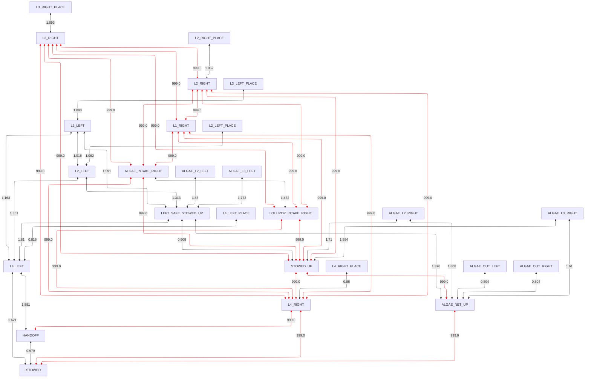

# Collision avoidance (right obstructed)

```mermaid
%%{ init: { "flowchart": { "defaultRenderer": "elk" } } }%%
graph TD

HANDOFF <-- 0.979 --> STOWED
L4_LEFT <-- 1.621 --> STOWED
L4_RIGHT <-- 999.0 --> STOWED
ALGAE_NET_UP <-- 999.0 --> STOWED
L4_LEFT <-- 1.881 --> HANDOFF
L4_RIGHT <-- 999.0 --> HANDOFF
LEFT_SAFE_STOWED_UP <-- 1.81 --> L4_LEFT
L2_LEFT <-- 1.361 --> L4_LEFT
L3_LEFT <-- 1.163 --> L4_LEFT
L4_LEFT_PLACE <-- 0.816 --> L4_LEFT
STOWED_UP <-- 999.0 --> L4_RIGHT
ALGAE_INTAKE_RIGHT <-- 999.0 --> L4_RIGHT
LOLLIPOP_INTAKE_RIGHT <-- 999.0 --> L4_RIGHT
L1_RIGHT <-- 999.0 --> L4_RIGHT
L2_RIGHT <-- 999.0 --> L4_RIGHT
L3_RIGHT <-- 999.0 --> L4_RIGHT
L4_RIGHT_PLACE <-- 0.86 --> L4_RIGHT
LEFT_SAFE_STOWED_UP <-- 1.376 --> ALGAE_NET_UP
STOWED_UP <-- 999.0 --> ALGAE_NET_UP
ALGAE_OUT_LEFT <-- 0.804 --> ALGAE_NET_UP
ALGAE_OUT_RIGHT <-- 0.804 --> ALGAE_NET_UP
ALGAE_L2_RIGHT <-- 1.808 --> ALGAE_NET_UP
ALGAE_L3_RIGHT <-- 1.61 --> ALGAE_NET_UP
LEFT_SAFE_STOWED_UP <-- 0.908 --> STOWED_UP
LOLLIPOP_INTAKE_RIGHT <-- 999.0 --> STOWED_UP
ALGAE_INTAKE_RIGHT <-- 999.0 --> STOWED_UP
L1_RIGHT <-- 999.0 --> STOWED_UP
L2_RIGHT <-- 999.0 --> STOWED_UP
L3_RIGHT <-- 999.0 --> STOWED_UP
ALGAE_L2_RIGHT <-- 1.71 --> STOWED_UP
ALGAE_L3_RIGHT <-- 1.884 --> STOWED_UP
L2_LEFT <-- 1.313 --> LEFT_SAFE_STOWED_UP
L3_LEFT <-- 1.591 --> LEFT_SAFE_STOWED_UP
ALGAE_L2_LEFT <-- 1.56 --> LEFT_SAFE_STOWED_UP
ALGAE_L3_LEFT <-- 1.773 --> LEFT_SAFE_STOWED_UP
ALGAE_INTAKE_RIGHT <-- 1.472 --> LOLLIPOP_INTAKE_RIGHT
L1_RIGHT <-- 999.0 --> LOLLIPOP_INTAKE_RIGHT
L2_RIGHT <-- 999.0 --> LOLLIPOP_INTAKE_RIGHT
L3_RIGHT <-- 999.0 --> LOLLIPOP_INTAKE_RIGHT
L1_RIGHT <-- 999.0 --> ALGAE_INTAKE_RIGHT
L2_RIGHT <-- 999.0 --> ALGAE_INTAKE_RIGHT
L3_RIGHT <-- 999.0 --> ALGAE_INTAKE_RIGHT
L3_LEFT <-- 1.016 --> L2_LEFT
L2_LEFT_PLACE <-- 1.062 --> L2_LEFT
L3_LEFT_PLACE <-- 1.093 --> L3_LEFT
L2_RIGHT <-- 999.0 --> L1_RIGHT
L3_RIGHT <-- 999.0 --> L1_RIGHT
L3_RIGHT <-- 999.0 --> L2_RIGHT
L2_RIGHT_PLACE <-- 1.062 --> L2_RIGHT
L3_RIGHT_PLACE <-- 1.093 --> L3_RIGHT

linkStyle 2,3,5,10,11,12,13,14,15,18,24,25,26,27,28,36,37,38,39,40,41,45,46,47 stroke:red;
```
