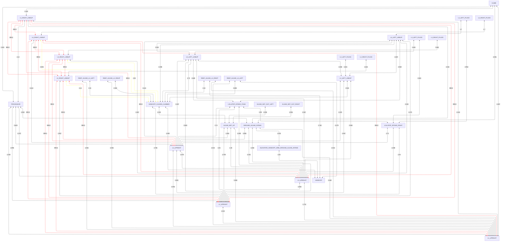

# Collision avoidance (right obstructed)

```mermaid
%%{ init: { "flowchart": { "defaultRenderer": "elk" } } }%%
graph TD

L2_UPRIGHT <-- 1.522 --> L1_UPRIGHT
L3_UPRIGHT <-- 1.732 --> L1_UPRIGHT
L4_UPRIGHT <-- 2.002 --> L1_UPRIGHT
ALGAE_NET_UP <-- 1.884 --> L1_UPRIGHT
L2_RIGHT_LINEUP <-- 999.0 --> L1_UPRIGHT
L3_RIGHT_LINEUP <-- 999.0 --> L1_UPRIGHT
L4_RIGHT_LINEUP <-- 999.0 --> L1_UPRIGHT
L1_RIGHT_LINEUP <-- 1.543 --> L1_UPRIGHT
GROUND_ALGAE_INTAKE <-- 2.462 --> L1_UPRIGHT
PROCESSOR <-- 2.349 --> L1_UPRIGHT
CLIMB <-- 1.697 --> L1_UPRIGHT
REEF_ALGAE_L2_LEFT <-- 2.355 --> L1_UPRIGHT
REEF_ALGAE_L2_RIGHT <-- 2.355 --> L1_UPRIGHT
REEF_ALGAE_L3_RIGHT <-- 2.524 --> L1_UPRIGHT
REEF_ALGAE_L3_LEFT <-- 2.524 --> L1_UPRIGHT
L3_UPRIGHT <-- 1.506 --> L2_UPRIGHT
L4_UPRIGHT <-- 1.851 --> L2_UPRIGHT
ALGAE_NET_UP <-- 1.709 --> L2_UPRIGHT
HANDOFF_CLEARS_CLIMBER <-- 2.786 --> L2_UPRIGHT
L2_LEFT_LINEUP <-- 1.567 --> L2_UPRIGHT
L2_RIGHT_LINEUP <-- 1.567 --> L2_UPRIGHT
GROUND_ALGAE_INTAKE <-- 2.152 --> L2_UPRIGHT
PROCESSOR <-- 1.995 --> L2_UPRIGHT
LOLLIPOP_INTAKE_RIGHT <-- 2.26 --> L2_UPRIGHT
LOLLIPOP_INTAKE_PUSH <-- 2.26 --> L2_UPRIGHT
L3_LEFT_LINEUP <-- 2.084 --> L2_UPRIGHT
L4_LEFT_LINEUP <-- 2.475 --> L2_UPRIGHT
L1_RIGHT_LINEUP <-- 999.0 --> L2_UPRIGHT
L3_RIGHT_LINEUP <-- 999.0 --> L2_UPRIGHT
L4_RIGHT_LINEUP <-- 999.0 --> L2_UPRIGHT
L4_UPRIGHT <-- 1.679 --> L3_UPRIGHT
ALGAE_NET_UP <-- 1.49 --> L3_UPRIGHT
L3_LEFT_LINEUP <-- 1.567 --> L3_UPRIGHT
L3_RIGHT_LINEUP <-- 1.567 --> L3_UPRIGHT
GROUND_ALGAE_INTAKE <-- 2.268 --> L3_UPRIGHT
PROCESSOR <-- 2.237 --> L3_UPRIGHT
LOLLIPOP_INTAKE_RIGHT <-- 2.469 --> L3_UPRIGHT
LOLLIPOP_INTAKE_PUSH <-- 2.469 --> L3_UPRIGHT
L2_LEFT_LINEUP <-- 2.084 --> L3_UPRIGHT
L4_LEFT_LINEUP <-- 2.303 --> L3_UPRIGHT
L1_RIGHT_LINEUP <-- 999.0 --> L3_UPRIGHT
L2_RIGHT_LINEUP <-- 999.0 --> L3_UPRIGHT
L4_RIGHT_LINEUP <-- 999.0 --> L3_UPRIGHT
ALGAE_NET_UP <-- 1.464 --> L4_UPRIGHT
L4_LEFT_LINEUP <-- 1.614 --> L4_UPRIGHT
L4_RIGHT_LINEUP <-- 1.614 --> L4_UPRIGHT
GROUND_ALGAE_INTAKE <-- 2.656 --> L4_UPRIGHT
PROCESSOR <-- 2.603 --> L4_UPRIGHT
LOLLIPOP_INTAKE_RIGHT <-- 2.74 --> L4_UPRIGHT
LOLLIPOP_INTAKE_PUSH <-- 2.74 --> L4_UPRIGHT
L2_LEFT_LINEUP <-- 2.429 --> L4_UPRIGHT
L3_LEFT_LINEUP <-- 2.257 --> L4_UPRIGHT
L1_RIGHT_LINEUP <-- 999.0 --> L4_UPRIGHT
L2_RIGHT_LINEUP <-- 999.0 --> L4_UPRIGHT
L3_RIGHT_LINEUP <-- 999.0 --> L4_UPRIGHT
ALGAE_NET_OUT_LEFT <-- 1.936 --> ALGAE_NET_UP
ALGAE_NET_OUT_RIGHT <-- 1.936 --> ALGAE_NET_UP
HANDOFF_CLEARS_CLIMBER <-- 2.332 --> ALGAE_NET_UP
HANDOFF_CLEARS_CLIMBER <-- 1.469 --> HANDOFF
ELEVATOR_HANDOFF_ARM_GROUND_ALGAE_INTAKE <-- 1.63 --> HANDOFF
REEF_ALGAE_L3_LEFT <-- 2.279 --> HANDOFF
REEF_ALGAE_L3_RIGHT <-- 1.762 --> HANDOFF
L2_LEFT_LINEUP <-- 2.941 --> HANDOFF_CLEARS_CLIMBER
L3_LEFT_LINEUP <-- 2.75 --> HANDOFF_CLEARS_CLIMBER
L4_LEFT_LINEUP <-- 2.498 --> HANDOFF_CLEARS_CLIMBER
L2_RIGHT_LINEUP <-- 3.14 --> HANDOFF_CLEARS_CLIMBER
L3_RIGHT_LINEUP <-- 2.95 --> HANDOFF_CLEARS_CLIMBER
L4_RIGHT_LINEUP <-- 2.694 --> HANDOFF_CLEARS_CLIMBER
REEF_ALGAE_L2_LEFT <-- 2.91 --> HANDOFF_CLEARS_CLIMBER
REEF_ALGAE_L3_LEFT <-- 2.698 --> HANDOFF_CLEARS_CLIMBER
REEF_ALGAE_L2_RIGHT <-- 2.392 --> HANDOFF_CLEARS_CLIMBER
REEF_ALGAE_L3_RIGHT <-- 2.18 --> HANDOFF_CLEARS_CLIMBER
GROUND_ALGAE_INTAKE <-- 1.534 --> ELEVATOR_HANDOFF_ARM_GROUND_ALGAE_INTAKE
L2_LEFT_PLACE <-- 1.621 --> L2_LEFT_LINEUP
L3_LEFT_LINEUP <-- 1.506 --> L2_LEFT_LINEUP
L4_LEFT_LINEUP <-- 2.087 --> L2_LEFT_LINEUP
L2_RIGHT_PLACE <-- 1.621 --> L2_RIGHT_LINEUP
L1_RIGHT_LINEUP <-- 999.0 --> L2_RIGHT_LINEUP
L3_RIGHT_LINEUP <-- 999.0 --> L2_RIGHT_LINEUP
L4_RIGHT_LINEUP <-- 999.0 --> L2_RIGHT_LINEUP
L1_RIGHT_LINEUP <-- 2.261 --> GROUND_ALGAE_INTAKE
PROCESSOR <-- 1.552 --> GROUND_ALGAE_INTAKE
CLIMB <-- 2.091 --> GROUND_ALGAE_INTAKE
L1_RIGHT_LINEUP <-- 2.12 --> PROCESSOR
CLIMB <-- 1.901 --> PROCESSOR
LOLLIPOP_INTAKE_PUSH <-- 0.99 --> LOLLIPOP_INTAKE_RIGHT
L3_LEFT_PLACE <-- 2.681 --> LOLLIPOP_INTAKE_RIGHT
L4_LEFT_PLACE <-- 2.952 --> LOLLIPOP_INTAKE_RIGHT
L3_LEFT_LINEUP <-- 2.669 --> LOLLIPOP_INTAKE_PUSH
L4_LEFT_LINEUP <-- 2.969 --> LOLLIPOP_INTAKE_PUSH
L3_LEFT_PLACE <-- 1.651 --> L3_LEFT_LINEUP
L4_LEFT_LINEUP <-- 1.915 --> L3_LEFT_LINEUP
L3_RIGHT_PLACE <-- 1.651 --> L3_RIGHT_LINEUP
L1_RIGHT_LINEUP <-- 999.0 --> L3_RIGHT_LINEUP
L4_RIGHT_LINEUP <-- 999.0 --> L3_RIGHT_LINEUP
L4_LEFT_PLACE <-- 1.7 --> L4_LEFT_LINEUP
L4_RIGHT_PLACE <-- 1.7 --> L4_RIGHT_LINEUP
L1_RIGHT_LINEUP <-- 999.0 --> L4_RIGHT_LINEUP
CLIMB <-- 1.431 --> L1_RIGHT_LINEUP

linkStyle 4,5,6,27,28,29,40,41,42,52,53,54,77,78,79,93,94,97 stroke:red;

linkStyle 65,66,67 stroke:yellow;
```
