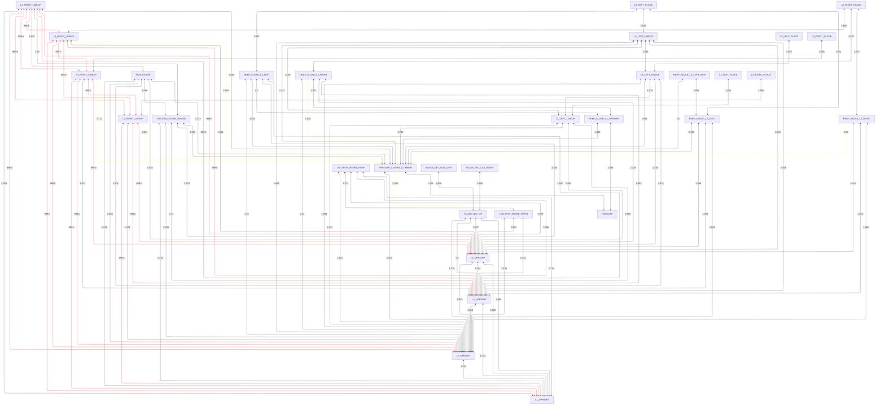

# Collision avoidance (right obstructed)

```mermaid
%%{ init: { "flowchart": { "defaultRenderer": "elk" } } }%%
graph TD

L2_UPRIGHT <-- 1.532 --> L1_UPRIGHT
L3_UPRIGHT <-- 1.742 --> L1_UPRIGHT
L4_UPRIGHT <-- 2.065 --> L1_UPRIGHT
ALGAE_NET_UP <-- 1.894 --> L1_UPRIGHT
L2_RIGHT_LINEUP <-- 999.0 --> L1_UPRIGHT
L3_RIGHT_LINEUP <-- 999.0 --> L1_UPRIGHT
L4_RIGHT_LINEUP <-- 999.0 --> L1_UPRIGHT
LOLLIPOP_INTAKE_PUSH <-- 2.138 --> L1_UPRIGHT
L1_RIGHT_LINEUP <-- 1.451 --> L1_UPRIGHT
GROUND_ALGAE_INTAKE <-- 2.314 --> L1_UPRIGHT
PROCESSOR <-- 2.216 --> L1_UPRIGHT
L3_UPRIGHT <-- 1.516 --> L2_UPRIGHT
L4_UPRIGHT <-- 1.922 --> L2_UPRIGHT
ALGAE_NET_UP <-- 1.719 --> L2_UPRIGHT
HANDOFF_CLEARS_CLIMBER <-- 2.612 --> L2_UPRIGHT
L2_LEFT_LINEUP <-- 1.471 --> L2_UPRIGHT
L2_RIGHT_LINEUP <-- 1.471 --> L2_UPRIGHT
GROUND_ALGAE_INTAKE <-- 2.005 --> L2_UPRIGHT
PROCESSOR <-- 1.862 --> L2_UPRIGHT
LOLLIPOP_INTAKE_RIGHT <-- 2.135 --> L2_UPRIGHT
LOLLIPOP_INTAKE_PUSH <-- 1.821 --> L2_UPRIGHT
REEF_ALGAE_L2_LEFT <-- 1.965 --> L2_UPRIGHT
REEF_ALGAE_L3_LEFT <-- 2.21 --> L2_UPRIGHT
REEF_ALGAE_L2_RIGHT <-- 1.965 --> L2_UPRIGHT
REEF_ALGAE_L3_RIGHT <-- 2.21 --> L2_UPRIGHT
L3_LEFT_LINEUP <-- 1.988 --> L2_UPRIGHT
L4_LEFT_LINEUP <-- 2.466 --> L2_UPRIGHT
L1_RIGHT_LINEUP <-- 999.0 --> L2_UPRIGHT
L3_RIGHT_LINEUP <-- 999.0 --> L2_UPRIGHT
L4_RIGHT_LINEUP <-- 999.0 --> L2_UPRIGHT
L4_UPRIGHT <-- 1.764 --> L3_UPRIGHT
ALGAE_NET_UP <-- 1.5 --> L3_UPRIGHT
L3_LEFT_LINEUP <-- 1.471 --> L3_UPRIGHT
L3_RIGHT_LINEUP <-- 1.471 --> L3_UPRIGHT
GROUND_ALGAE_INTAKE <-- 2.12 --> L3_UPRIGHT
PROCESSOR <-- 2.104 --> L3_UPRIGHT
LOLLIPOP_INTAKE_RIGHT <-- 2.344 --> L3_UPRIGHT
LOLLIPOP_INTAKE_PUSH <-- 2.186 --> L3_UPRIGHT
REEF_ALGAE_L2_LEFT <-- 1.919 --> L3_UPRIGHT
REEF_ALGAE_L3_LEFT <-- 1.942 --> L3_UPRIGHT
REEF_ALGAE_L2_RIGHT <-- 1.919 --> L3_UPRIGHT
REEF_ALGAE_L3_RIGHT <-- 1.942 --> L3_UPRIGHT
L2_LEFT_LINEUP <-- 1.988 --> L3_UPRIGHT
L4_LEFT_LINEUP <-- 2.308 --> L3_UPRIGHT
L1_RIGHT_LINEUP <-- 999.0 --> L3_UPRIGHT
L2_RIGHT_LINEUP <-- 999.0 --> L3_UPRIGHT
L4_RIGHT_LINEUP <-- 999.0 --> L3_UPRIGHT
ALGAE_NET_UP <-- 1.577 --> L4_UPRIGHT
L4_LEFT_LINEUP <-- 1.544 --> L4_UPRIGHT
L4_RIGHT_LINEUP <-- 1.544 --> L4_UPRIGHT
GROUND_ALGAE_INTAKE <-- 2.573 --> L4_UPRIGHT
PROCESSOR <-- 2.533 --> L4_UPRIGHT
LOLLIPOP_INTAKE_RIGHT <-- 2.667 --> L4_UPRIGHT
LOLLIPOP_INTAKE_PUSH <-- 2.578 --> L4_UPRIGHT
REEF_ALGAE_L2_LEFT <-- 2.414 --> L4_UPRIGHT
REEF_ALGAE_L3_LEFT <-- 2.248 --> L4_UPRIGHT
REEF_ALGAE_L2_RIGHT <-- 2.414 --> L4_UPRIGHT
REEF_ALGAE_L3_RIGHT <-- 2.248 --> L4_UPRIGHT
L2_LEFT_LINEUP <-- 2.393 --> L4_UPRIGHT
L3_LEFT_LINEUP <-- 2.235 --> L4_UPRIGHT
L1_RIGHT_LINEUP <-- 999.0 --> L4_UPRIGHT
L2_RIGHT_LINEUP <-- 999.0 --> L4_UPRIGHT
L3_RIGHT_LINEUP <-- 999.0 --> L4_UPRIGHT
ALGAE_NET_OUT_LEFT <-- 1.948 --> ALGAE_NET_UP
ALGAE_NET_OUT_RIGHT <-- 1.948 --> ALGAE_NET_UP
HANDOFF_CLEARS_CLIMBER <-- 2.342 --> ALGAE_NET_UP
HANDOFF_CLEARS_CLIMBER <-- 1.479 --> HANDOFF
REEF_ALGAE_L3_UPRIGHT <-- 1.065 --> HANDOFF
REEF_ALGAE_L3_UPRIGHT <-- 1.483 --> HANDOFF_CLEARS_CLIMBER
L2_LEFT_LINEUP <-- 2.739 --> HANDOFF_CLEARS_CLIMBER
L3_LEFT_LINEUP <-- 2.548 --> HANDOFF_CLEARS_CLIMBER
L4_LEFT_LINEUP <-- 2.447 --> HANDOFF_CLEARS_CLIMBER
REEF_ALGAE_L2_LEFT <-- 2.695 --> HANDOFF_CLEARS_CLIMBER
REEF_ALGAE_L3_LEFT <-- 2.483 --> HANDOFF_CLEARS_CLIMBER
L2_RIGHT_LINEUP <-- 2.901 --> HANDOFF_CLEARS_CLIMBER
L3_RIGHT_LINEUP <-- 2.711 --> HANDOFF_CLEARS_CLIMBER
L4_RIGHT_LINEUP <-- 2.604 --> HANDOFF_CLEARS_CLIMBER
REEF_ALGAE_L2_RIGHT <-- 2.85 --> HANDOFF_CLEARS_CLIMBER
REEF_ALGAE_L3_RIGHT <-- 2.638 --> HANDOFF_CLEARS_CLIMBER
L1_RIGHT_LINEUP <-- 2.638 --> HANDOFF_CLEARS_CLIMBER
GROUND_ALGAE_INTAKE <-- 2.153 --> HANDOFF_CLEARS_CLIMBER
PROCESSOR <-- 2.273 --> HANDOFF_CLEARS_CLIMBER
REEF_ALGAE_L2_LEFT_ARM <-- 2.0 --> HANDOFF_CLEARS_CLIMBER
REEF_ALGAE_L3_RIGHT <-- 1.577 --> REEF_ALGAE_L3_UPRIGHT
REEF_ALGAE_L3_LEFT <-- 2.0 --> REEF_ALGAE_L3_UPRIGHT
L2_LEFT_PLACE <-- 1.562 --> L2_LEFT_LINEUP
L3_LEFT_LINEUP <-- 1.516 --> L2_LEFT_LINEUP
L4_LEFT_LINEUP <-- 2.194 --> L2_LEFT_LINEUP
L2_RIGHT_PLACE <-- 1.562 --> L2_RIGHT_LINEUP
L1_RIGHT_LINEUP <-- 999.0 --> L2_RIGHT_LINEUP
L3_RIGHT_LINEUP <-- 999.0 --> L2_RIGHT_LINEUP
L4_RIGHT_LINEUP <-- 999.0 --> L2_RIGHT_LINEUP
L1_RIGHT_LINEUP <-- 2.15 --> GROUND_ALGAE_INTAKE
PROCESSOR <-- 1.496 --> GROUND_ALGAE_INTAKE
L1_RIGHT_LINEUP <-- 2.029 --> PROCESSOR
LOLLIPOP_INTAKE_PUSH <-- 1.711 --> LOLLIPOP_INTAKE_RIGHT
L4_LEFT_PLACE <-- 1.671 --> REEF_ALGAE_L2_LEFT
REEF_ALGAE_L2_LEFT_ARM <-- 1.695 --> REEF_ALGAE_L2_LEFT
L4_LEFT_PLACE <-- 1.447 --> REEF_ALGAE_L3_LEFT
L4_RIGHT_PLACE <-- 1.671 --> REEF_ALGAE_L2_RIGHT
L4_RIGHT_PLACE <-- 1.447 --> REEF_ALGAE_L3_RIGHT
L3_LEFT_PLACE <-- 1.593 --> L3_LEFT_LINEUP
L4_LEFT_LINEUP <-- 2.036 --> L3_LEFT_LINEUP
L3_RIGHT_PLACE <-- 1.593 --> L3_RIGHT_LINEUP
L1_RIGHT_LINEUP <-- 999.0 --> L3_RIGHT_LINEUP
L4_RIGHT_LINEUP <-- 999.0 --> L3_RIGHT_LINEUP
L4_LEFT_PLACE <-- 1.692 --> L4_LEFT_LINEUP
L4_RIGHT_PLACE <-- 1.692 --> L4_RIGHT_LINEUP
L1_RIGHT_LINEUP <-- 999.0 --> L4_RIGHT_LINEUP

linkStyle 4,5,6,27,28,29,44,45,46,60,61,62,89,90,91,104,105,108 stroke:red;

linkStyle 65,74,75,76,77,78 stroke:yellow;
```
