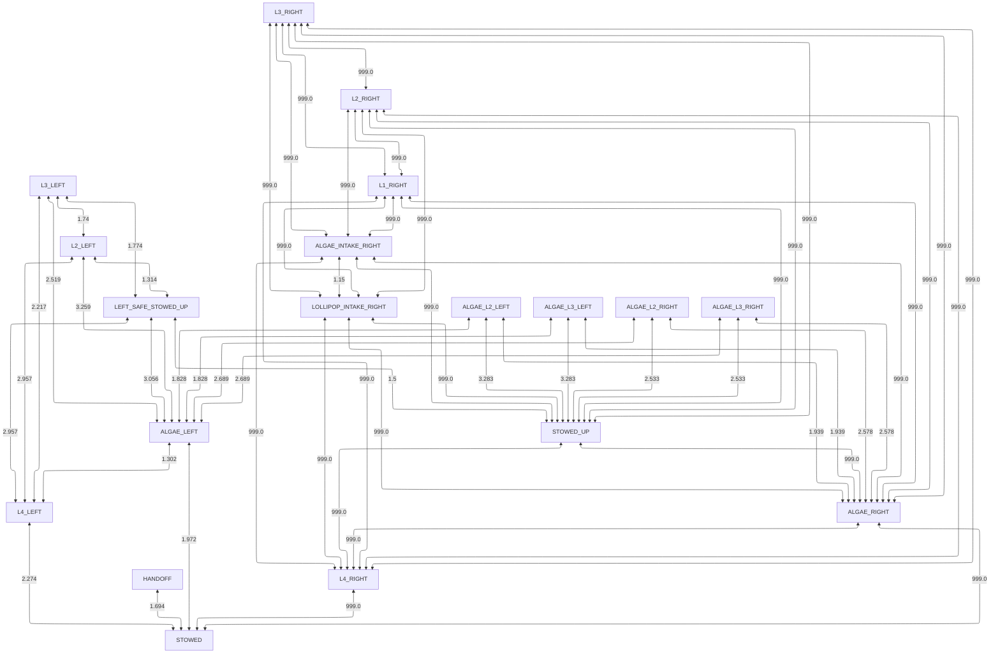

# Collision avoidance (right obstructed)

```mermaid
%%{ init: { "flowchart": { "defaultRenderer": "elk" } } }%%
graph TD

HANDOFF <-- 1.694 --> STOWED
L4_LEFT <-- 2.274 --> STOWED
L4_RIGHT <-- 999.0 --> STOWED
ALGAE_RIGHT <-- 999.0 --> STOWED
ALGAE_LEFT <-- 1.972 --> STOWED
LEFT_SAFE_STOWED_UP <-- 2.957 --> L4_LEFT
L2_LEFT <-- 2.957 --> L4_LEFT
L3_LEFT <-- 2.217 --> L4_LEFT
ALGAE_LEFT <-- 1.302 --> L4_LEFT
STOWED_UP <-- 999.0 --> L4_RIGHT
ALGAE_INTAKE_RIGHT <-- 999.0 --> L4_RIGHT
LOLLIPOP_INTAKE_RIGHT <-- 999.0 --> L4_RIGHT
L1_RIGHT <-- 999.0 --> L4_RIGHT
L2_RIGHT <-- 999.0 --> L4_RIGHT
L3_RIGHT <-- 999.0 --> L4_RIGHT
ALGAE_RIGHT <-- 999.0 --> L4_RIGHT
STOWED_UP <-- 999.0 --> ALGAE_RIGHT
ALGAE_L2_LEFT <-- 1.939 --> ALGAE_RIGHT
ALGAE_L3_LEFT <-- 1.939 --> ALGAE_RIGHT
ALGAE_INTAKE_RIGHT <-- 999.0 --> ALGAE_RIGHT
LOLLIPOP_INTAKE_RIGHT <-- 999.0 --> ALGAE_RIGHT
L1_RIGHT <-- 999.0 --> ALGAE_RIGHT
L2_RIGHT <-- 999.0 --> ALGAE_RIGHT
L3_RIGHT <-- 999.0 --> ALGAE_RIGHT
ALGAE_L2_RIGHT <-- 2.578 --> ALGAE_RIGHT
ALGAE_L3_RIGHT <-- 2.578 --> ALGAE_RIGHT
LEFT_SAFE_STOWED_UP <-- 3.056 --> ALGAE_LEFT
L2_LEFT <-- 3.259 --> ALGAE_LEFT
L3_LEFT <-- 2.519 --> ALGAE_LEFT
ALGAE_L2_LEFT <-- 1.828 --> ALGAE_LEFT
ALGAE_L3_LEFT <-- 1.828 --> ALGAE_LEFT
ALGAE_L2_RIGHT <-- 2.689 --> ALGAE_LEFT
ALGAE_L3_RIGHT <-- 2.689 --> ALGAE_LEFT
LEFT_SAFE_STOWED_UP <-- 1.5 --> STOWED_UP
LOLLIPOP_INTAKE_RIGHT <-- 999.0 --> STOWED_UP
ALGAE_INTAKE_RIGHT <-- 999.0 --> STOWED_UP
L1_RIGHT <-- 999.0 --> STOWED_UP
L2_RIGHT <-- 999.0 --> STOWED_UP
L3_RIGHT <-- 999.0 --> STOWED_UP
ALGAE_L2_LEFT <-- 3.283 --> STOWED_UP
ALGAE_L2_RIGHT <-- 2.533 --> STOWED_UP
ALGAE_L3_LEFT <-- 3.283 --> STOWED_UP
ALGAE_L3_RIGHT <-- 2.533 --> STOWED_UP
L2_LEFT <-- 1.314 --> LEFT_SAFE_STOWED_UP
L3_LEFT <-- 1.774 --> LEFT_SAFE_STOWED_UP
ALGAE_INTAKE_RIGHT <-- 1.15 --> LOLLIPOP_INTAKE_RIGHT
L1_RIGHT <-- 999.0 --> LOLLIPOP_INTAKE_RIGHT
L2_RIGHT <-- 999.0 --> LOLLIPOP_INTAKE_RIGHT
L3_RIGHT <-- 999.0 --> LOLLIPOP_INTAKE_RIGHT
L1_RIGHT <-- 999.0 --> ALGAE_INTAKE_RIGHT
L2_RIGHT <-- 999.0 --> ALGAE_INTAKE_RIGHT
L3_RIGHT <-- 999.0 --> ALGAE_INTAKE_RIGHT
L3_LEFT <-- 1.74 --> L2_LEFT
L2_RIGHT <-- 999.0 --> L1_RIGHT
L3_RIGHT <-- 999.0 --> L1_RIGHT
L3_RIGHT <-- 999.0 --> L2_RIGHT
```
