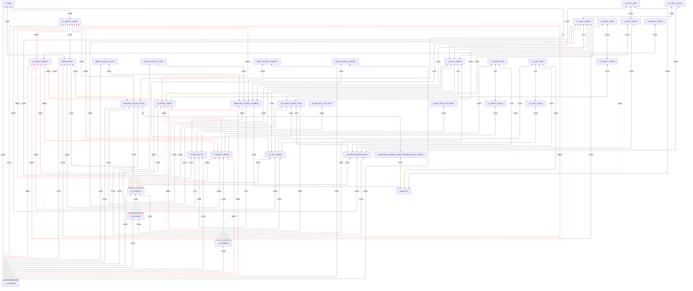

# Collision avoidance (right obstructed)

```mermaid
%%{ init: { "flowchart": { "defaultRenderer": "elk" } } }%%
graph TD

L2_UPRIGHT <-- 1.182 --> L1_UPRIGHT
L3_UPRIGHT <-- 1.392 --> L1_UPRIGHT
L4_UPRIGHT <-- 1.662 --> L1_UPRIGHT
ALGAE_NET_UP <-- 1.544 --> L1_UPRIGHT
L2_RIGHT_LINEUP <-- 999.0 --> L1_UPRIGHT
L3_RIGHT_LINEUP <-- 999.0 --> L1_UPRIGHT
L4_RIGHT_LINEUP <-- 999.0 --> L1_UPRIGHT
L1_RIGHT_LINEUP <-- 1.144 --> L1_UPRIGHT
GROUND_ALGAE_INTAKE <-- 2.031 --> L1_UPRIGHT
PROCESSOR <-- 1.927 --> L1_UPRIGHT
CLIMB <-- 1.282 --> L1_UPRIGHT
REEF_ALGAE_L2_LEFT <-- 1.941 --> L1_UPRIGHT
REEF_ALGAE_L2_RIGHT <-- 1.941 --> L1_UPRIGHT
REEF_ALGAE_L3_RIGHT <-- 2.109 --> L1_UPRIGHT
REEF_ALGAE_L3_LEFT <-- 2.109 --> L1_UPRIGHT
L3_UPRIGHT <-- 1.166 --> L2_UPRIGHT
L4_UPRIGHT <-- 1.511 --> L2_UPRIGHT
ALGAE_NET_UP <-- 1.369 --> L2_UPRIGHT
HANDOFF_CLEARS_CLIMBER <-- 2.34 --> L2_UPRIGHT
L2_LEFT_LINEUP <-- 1.166 --> L2_UPRIGHT
L2_RIGHT_LINEUP <-- 1.166 --> L2_UPRIGHT
GROUND_ALGAE_INTAKE <-- 1.722 --> L2_UPRIGHT
PROCESSOR <-- 1.573 --> L2_UPRIGHT
LOLLIPOP_INTAKE_RIGHT <-- 1.842 --> L2_UPRIGHT
LOLLIPOP_INTAKE_PUSH <-- 1.842 --> L2_UPRIGHT
L3_LEFT_LINEUP <-- 1.683 --> L2_UPRIGHT
L4_LEFT_LINEUP <-- 2.069 --> L2_UPRIGHT
L1_RIGHT_LINEUP <-- 999.0 --> L2_UPRIGHT
L3_RIGHT_LINEUP <-- 999.0 --> L2_UPRIGHT
L4_RIGHT_LINEUP <-- 999.0 --> L2_UPRIGHT
L4_UPRIGHT <-- 1.339 --> L3_UPRIGHT
ALGAE_NET_UP <-- 1.15 --> L3_UPRIGHT
L3_LEFT_LINEUP <-- 1.166 --> L3_UPRIGHT
L3_RIGHT_LINEUP <-- 1.166 --> L3_UPRIGHT
GROUND_ALGAE_INTAKE <-- 1.837 --> L3_UPRIGHT
PROCESSOR <-- 1.815 --> L3_UPRIGHT
LOLLIPOP_INTAKE_RIGHT <-- 2.052 --> L3_UPRIGHT
LOLLIPOP_INTAKE_PUSH <-- 2.052 --> L3_UPRIGHT
L2_LEFT_LINEUP <-- 1.683 --> L3_UPRIGHT
L4_LEFT_LINEUP <-- 1.897 --> L3_UPRIGHT
L1_RIGHT_LINEUP <-- 999.0 --> L3_UPRIGHT
L2_RIGHT_LINEUP <-- 999.0 --> L3_UPRIGHT
L4_RIGHT_LINEUP <-- 999.0 --> L3_UPRIGHT
ALGAE_NET_UP <-- 1.124 --> L4_UPRIGHT
L4_LEFT_LINEUP <-- 1.208 --> L4_UPRIGHT
L4_RIGHT_LINEUP <-- 1.208 --> L4_UPRIGHT
GROUND_ALGAE_INTAKE <-- 2.225 --> L4_UPRIGHT
PROCESSOR <-- 2.181 --> L4_UPRIGHT
LOLLIPOP_INTAKE_RIGHT <-- 2.322 --> L4_UPRIGHT
LOLLIPOP_INTAKE_PUSH <-- 2.322 --> L4_UPRIGHT
L2_LEFT_LINEUP <-- 2.028 --> L4_UPRIGHT
L3_LEFT_LINEUP <-- 1.856 --> L4_UPRIGHT
L1_RIGHT_LINEUP <-- 999.0 --> L4_UPRIGHT
L2_RIGHT_LINEUP <-- 999.0 --> L4_UPRIGHT
L3_RIGHT_LINEUP <-- 999.0 --> L4_UPRIGHT
ALGAE_NET_OUT_LEFT <-- 1.546 --> ALGAE_NET_UP
ALGAE_NET_OUT_RIGHT <-- 1.546 --> ALGAE_NET_UP
HANDOFF_CLEARS_CLIMBER <-- 1.886 --> ALGAE_NET_UP
HANDOFF_CLEARS_CLIMBER <-- 1.129 --> HANDOFF
ELEVATOR_HANDOFF_ARM_GROUND_ALGAE_INTAKE <-- 1.607 --> HANDOFF
L2_RIGHT_ARM <-- 1.861 --> HANDOFF
L3_RIGHT_ARM <-- 1.861 --> HANDOFF
L2_LEFT_ARM <-- 1.683 --> HANDOFF
L3_LEFT_ARM <-- 1.683 --> HANDOFF
L4_LEFT_LINEUP <-- 2.033 --> HANDOFF_CLEARS_CLIMBER
L4_RIGHT_LINEUP <-- 2.208 --> HANDOFF_CLEARS_CLIMBER
REEF_ALGAE_L2_LEFT <-- 2.441 --> HANDOFF_CLEARS_CLIMBER
REEF_ALGAE_L3_LEFT <-- 2.228 --> HANDOFF_CLEARS_CLIMBER
REEF_ALGAE_L2_RIGHT <-- 1.978 --> HANDOFF_CLEARS_CLIMBER
REEF_ALGAE_L3_RIGHT <-- 1.766 --> HANDOFF_CLEARS_CLIMBER
GROUND_ALGAE_INTAKE <-- 1.4 --> ELEVATOR_HANDOFF_ARM_GROUND_ALGAE_INTAKE
L2_LEFT_PLACE <-- 1.242 --> L2_LEFT_LINEUP
LOLLIPOP_INTAKE_PUSH <-- 2.02 --> L2_LEFT_LINEUP
L3_LEFT_LINEUP <-- 1.166 --> L2_LEFT_LINEUP
L4_LEFT_LINEUP <-- 1.722 --> L2_LEFT_LINEUP
L2_LEFT_ARM <-- 1.286 --> L2_LEFT_LINEUP
L2_RIGHT_PLACE <-- 1.242 --> L2_RIGHT_LINEUP
L1_RIGHT_LINEUP <-- 999.0 --> L2_RIGHT_LINEUP
L3_RIGHT_LINEUP <-- 999.0 --> L2_RIGHT_LINEUP
L4_RIGHT_LINEUP <-- 999.0 --> L2_RIGHT_LINEUP
L2_RIGHT_ARM <-- 1.286 --> L2_RIGHT_LINEUP
L1_RIGHT_LINEUP <-- 1.851 --> GROUND_ALGAE_INTAKE
PROCESSOR <-- 1.174 --> GROUND_ALGAE_INTAKE
CLIMB <-- 1.7 --> GROUND_ALGAE_INTAKE
L1_RIGHT_LINEUP <-- 1.722 --> PROCESSOR
CLIMB <-- 1.525 --> PROCESSOR
LOLLIPOP_INTAKE_PUSH <-- 0.65 --> LOLLIPOP_INTAKE_RIGHT
L3_LEFT_PLACE <-- 2.235 --> LOLLIPOP_INTAKE_RIGHT
L4_LEFT_PLACE <-- 2.504 --> LOLLIPOP_INTAKE_RIGHT
L2_LEFT_ARM <-- 2.317 --> LOLLIPOP_INTAKE_RIGHT
L2_RIGHT_ARM <-- 1.89 --> LOLLIPOP_INTAKE_RIGHT
L3_LEFT_LINEUP <-- 2.23 --> LOLLIPOP_INTAKE_PUSH
L4_LEFT_LINEUP <-- 2.527 --> LOLLIPOP_INTAKE_PUSH
L3_LEFT_PLACE <-- 1.272 --> L3_LEFT_LINEUP
L4_LEFT_LINEUP <-- 1.55 --> L3_LEFT_LINEUP
L3_LEFT_ARM <-- 1.021 --> L3_LEFT_LINEUP
L3_RIGHT_PLACE <-- 1.272 --> L3_RIGHT_LINEUP
L1_RIGHT_LINEUP <-- 999.0 --> L3_RIGHT_LINEUP
L4_RIGHT_LINEUP <-- 999.0 --> L3_RIGHT_LINEUP
L3_RIGHT_ARM <-- 1.021 --> L3_RIGHT_LINEUP
L4_LEFT_PLACE <-- 1.325 --> L4_LEFT_LINEUP
L4_RIGHT_PLACE <-- 1.325 --> L4_RIGHT_LINEUP
L1_RIGHT_LINEUP <-- 999.0 --> L4_RIGHT_LINEUP
CLIMB <-- 1.044 --> L1_RIGHT_LINEUP
L2_LEFT_ARM <-- 1.67 --> L2_LEFT_PLACE
L3_LEFT_ARM <-- 1.453 --> L3_LEFT_PLACE
L2_RIGHT_ARM <-- 1.67 --> L2_RIGHT_PLACE
L3_RIGHT_ARM <-- 1.453 --> L3_RIGHT_PLACE

linkStyle 4,5,6,27,28,29,40,41,42,52,53,54,77,78,79,97,98,102 stroke:red;

linkStyle 60,61,65 stroke:yellow;
```
