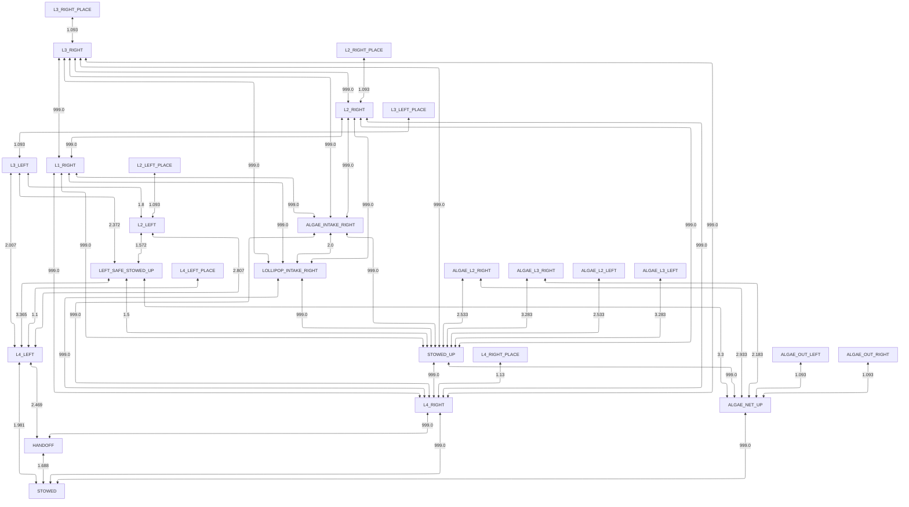

# Collision avoidance (right obstructed)

```mermaid
%%{ init: { "flowchart": { "defaultRenderer": "elk" } } }%%
graph TD

HANDOFF <-- 1.688 --> STOWED
L4_LEFT <-- 1.981 --> STOWED
L4_RIGHT <-- 999.0 --> STOWED
ALGAE_NET_UP <-- 999.0 --> STOWED
L4_LEFT <-- 2.469 --> HANDOFF
L4_RIGHT <-- 999.0 --> HANDOFF
LEFT_SAFE_STOWED_UP <-- 3.365 --> L4_LEFT
L2_LEFT <-- 2.807 --> L4_LEFT
L3_LEFT <-- 2.007 --> L4_LEFT
L4_LEFT_PLACE <-- 1.1 --> L4_LEFT
STOWED_UP <-- 999.0 --> L4_RIGHT
ALGAE_INTAKE_RIGHT <-- 999.0 --> L4_RIGHT
LOLLIPOP_INTAKE_RIGHT <-- 999.0 --> L4_RIGHT
L1_RIGHT <-- 999.0 --> L4_RIGHT
L2_RIGHT <-- 999.0 --> L4_RIGHT
L3_RIGHT <-- 999.0 --> L4_RIGHT
L4_RIGHT_PLACE <-- 1.13 --> L4_RIGHT
LEFT_SAFE_STOWED_UP <-- 3.3 --> ALGAE_NET_UP
STOWED_UP <-- 999.0 --> ALGAE_NET_UP
ALGAE_OUT_LEFT <-- 1.093 --> ALGAE_NET_UP
ALGAE_OUT_RIGHT <-- 1.093 --> ALGAE_NET_UP
ALGAE_L2_RIGHT <-- 2.933 --> ALGAE_NET_UP
ALGAE_L3_RIGHT <-- 2.183 --> ALGAE_NET_UP
LEFT_SAFE_STOWED_UP <-- 1.5 --> STOWED_UP
LOLLIPOP_INTAKE_RIGHT <-- 999.0 --> STOWED_UP
ALGAE_INTAKE_RIGHT <-- 999.0 --> STOWED_UP
L1_RIGHT <-- 999.0 --> STOWED_UP
L2_RIGHT <-- 999.0 --> STOWED_UP
L3_RIGHT <-- 999.0 --> STOWED_UP
ALGAE_L2_LEFT <-- 2.533 --> STOWED_UP
ALGAE_L2_RIGHT <-- 2.533 --> STOWED_UP
ALGAE_L3_LEFT <-- 3.283 --> STOWED_UP
ALGAE_L3_RIGHT <-- 3.283 --> STOWED_UP
L2_LEFT <-- 1.572 --> LEFT_SAFE_STOWED_UP
L3_LEFT <-- 2.372 --> LEFT_SAFE_STOWED_UP
ALGAE_INTAKE_RIGHT <-- 2.0 --> LOLLIPOP_INTAKE_RIGHT
L1_RIGHT <-- 999.0 --> LOLLIPOP_INTAKE_RIGHT
L2_RIGHT <-- 999.0 --> LOLLIPOP_INTAKE_RIGHT
L3_RIGHT <-- 999.0 --> LOLLIPOP_INTAKE_RIGHT
L1_RIGHT <-- 999.0 --> ALGAE_INTAKE_RIGHT
L2_RIGHT <-- 999.0 --> ALGAE_INTAKE_RIGHT
L3_RIGHT <-- 999.0 --> ALGAE_INTAKE_RIGHT
L3_LEFT <-- 1.8 --> L2_LEFT
L2_LEFT_PLACE <-- 1.093 --> L2_LEFT
L3_LEFT_PLACE <-- 1.093 --> L3_LEFT
L2_RIGHT <-- 999.0 --> L1_RIGHT
L3_RIGHT <-- 999.0 --> L1_RIGHT
L3_RIGHT <-- 999.0 --> L2_RIGHT
L2_RIGHT_PLACE <-- 1.093 --> L2_RIGHT
L3_RIGHT_PLACE <-- 1.093 --> L3_RIGHT
```
