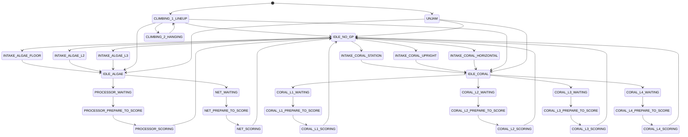

# States

```mermaid
stateDiagram-v2
    %% Intaking algae
    IDLE_NO_GP --> INTAKE_ALGAE_FLOOR
    IDLE_NO_GP --> INTAKE_ALGAE_L2
    IDLE_NO_GP --> INTAKE_ALGAE_L3
    INTAKE_ALGAE_FLOOR --> IDLE_ALGAE
    INTAKE_ALGAE_L2 --> IDLE_ALGAE
    INTAKE_ALGAE_L3 --> IDLE_ALGAE

    %% Intaking coral
    IDLE_NO_GP --> INTAKE_CORAL_STATION
    IDLE_NO_GP --> INTAKE_CORAL_UPRIGHT
    IDLE_NO_GP --> INTAKE_CORAL_HORIZONTAL
    INTAKE_CORAL_STATION --> IDLE_CORAL
    INTAKE_CORAL_UPRIGHT --> IDLE_CORAL
    INTAKE_CORAL_HORIZONTAL --> IDLE_CORAL

    %% Algae scoring
    IDLE_ALGAE --> PROCESSOR_WAITING
    PROCESSOR_WAITING --> PROCESSOR_PREPARE_TO_SCORE
    PROCESSOR_PREPARE_TO_SCORE --> PROCESSOR_SCORING
    PROCESSOR_SCORING --> IDLE_NO_GP
    IDLE_ALGAE --> NET_WAITING
    NET_WAITING --> NET_PREPARE_TO_SCORE
    NET_PREPARE_TO_SCORE --> NET_SCORING
    NET_SCORING --> IDLE_NO_GP

    %% Coral scoring
    IDLE_CORAL --> CORAL_L1_WAITING
    CORAL_L1_WAITING --> CORAL_L1_PREPARE_TO_SCORE
    CORAL_L1_PREPARE_TO_SCORE --> CORAL_L1_SCORING
    CORAL_L1_SCORING --> IDLE_NO_GP

    IDLE_CORAL --> CORAL_L2_WAITING
    CORAL_L2_WAITING --> CORAL_L2_PREPARE_TO_SCORE
    CORAL_L2_PREPARE_TO_SCORE --> CORAL_L2_SCORING
    CORAL_L2_SCORING --> IDLE_NO_GP

    IDLE_CORAL --> CORAL_L3_WAITING
    CORAL_L3_WAITING --> CORAL_L3_PREPARE_TO_SCORE
    CORAL_L3_PREPARE_TO_SCORE --> CORAL_L3_SCORING
    CORAL_L3_SCORING --> IDLE_NO_GP

    IDLE_CORAL --> CORAL_L4_WAITING
    CORAL_L4_WAITING --> CORAL_L4_PREPARE_TO_SCORE
    CORAL_L4_PREPARE_TO_SCORE --> CORAL_L4_SCORING
    CORAL_L4_SCORING --> IDLE_NO_GP

    %% Climbing
    [*] --> CLIMBING_1_LINEUP
    CLIMBING_1_LINEUP --> IDLE_NO_GP
    CLIMBING_1_LINEUP --> IDLE_CORAL
    CLIMBING_1_LINEUP --> IDLE_ALGAE
    CLIMBING_1_LINEUP --> CLIMBING_2_HANGING
    CLIMBING_2_HANGING --> CLIMBING_1_LINEUP

    %% Unjam
    [*] --> UNJAM
    UNJAM --> IDLE_NO_GP
    UNJAM --> IDLE_CORAL
    UNJAM --> IDLE_ALGAE
```
